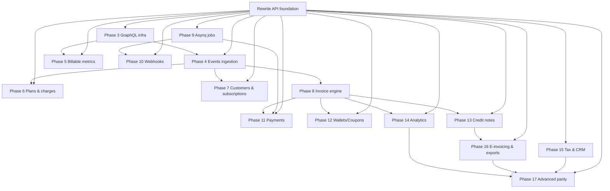
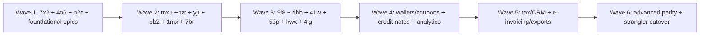

# Implementation Plan from `bd` Issues

## Progress Update (2026-03-18)

- Closed `lago-fork-7x2`: gqlgen initialized and `/graphql` exposed with introspection test.
- Closed `lago-fork-4o6`: Asynq runtime/worker/scheduler/retry/uniqueness implemented with miniredis tests.
- Closed `lago-fork-mxu`: GraphQL auth context, error formatting, pagination helpers, and dataloader scaffolding added.
- Closed `lago-fork-n2c`: customers CRUD + metadata + portal URL flows implemented with handler/service coverage.

## Problem and Goal

Create an executable plan that converts all currently open `bd` epics/features into dependency-ordered implementation work for the Go rewrite (`api-go`), with explicit module touchpoints, edge cases, and missing requirements.

## Current Backlog Snapshot

- Open issues: 48
- Open epics: 19
- Open non-epic issues: 29
- Ready now (`bd ready`): `lago-fork-59c`, `lago-fork-4o6`, `lago-fork-n2c`, `lago-fork-7x2`, `lago-fork-ekc`, `lago-fork-a2n`, `lago-fork-bpr`, `lago-fork-7hd`, `lago-fork-iql`, `lago-fork-5in`
- Foundational closed blockers already satisfied: `lago-fork-cyq`, `lago-fork-93v`, `lago-fork-a7p`, `lago-fork-db3`, `lago-fork-0h9`

## High-Level Architecture Approach

1. Stabilize platform slices first (`GraphQL infra`, `events ingestion`, `job runtime`), then build domain modules that depend on them.
2. Keep REST + GraphQL parity by implementing service layer first, then exposing through handlers/resolvers.
3. Drive all async side effects through Asynq jobs and idempotency keys.
4. Lock invoice engine determinism before downstream domains (payments, credit notes, analytics).

## Workstreams by Epic / Issue

### Phase 3 GraphQL Infrastructure

- **`lago-fork-598` Epic: Phase 3 GraphQL Infrastructure**
  - Tasks: scaffold GraphQL runtime and shared resolver infrastructure.
  - Files/modules: `api-go/internal/server`, new `api-go/internal/graphql/**`, `api-go/cmd/**`.
  - Edge cases: auth context propagation, partial errors, cursor pagination consistency.
  - Missing info: canonical schema ownership/update process.

- **`lago-fork-7x2` Initialize gqlgen and expose `/graphql`**
  - Tasks: generate gqlgen from existing schema, wire router, add playground toggle.
  - Files/modules: `api-go/internal/server/server.go`, `api-go/config/**`, new gqlgen config + generated files.
  - Edge cases: generated code drift, schema compile failures in CI.
  - Missing info: production playground policy.

- **`lago-fork-mxu` GraphQL auth/errors/pagination/dataloaders**
  - Tasks: context auth middleware, RFC-compliant error formatter, cursor helpers, dataloaders.
  - Files/modules: `api-go/internal/middleware/**`, new `api-go/internal/graphql/dataloader/**`, `api-go/internal/graphql/resolvers/**`.
  - Edge cases: N+1 reintroduction, unauthorized field-level access.
  - Missing info: global error code mapping for GraphQL.

### Phase 4 Events Ingestion API

- **`lago-fork-5in` Epic: Phase 4 Events Ingestion API**
  - Tasks: coordinate ingestion + downstream publishing.
  - Files/modules: `api-go/internal/handlers/events/**`, `api-go/internal/services/events/**`.
  - Edge cases: duplicate ingestion, out-of-order events.
  - Missing info: retention policy for raw events.

- **`lago-fork-tzr` Events listing/estimate_fees + Kafka publishing**
  - Tasks: implement list and estimate endpoints, publish raw events to Kafka topic.
  - Files/modules: `api-go/internal/handlers/events/**`, `api-go/internal/services/events/**`, new Kafka adapter under `api-go/internal/adapters/kafka/**`.
  - Edge cases: at-least-once duplication, estimate mismatch vs invoice engine.
  - Missing info: Kafka topic/partition strategy and DLQ contract.

### Phase 5 Billable Metrics CRUD

- **`lago-fork-xqr` Epic: Phase 5 Billable Metrics CRUD**
  - Tasks: orchestrate REST + GraphQL metric CRUD rollout.
  - Files/modules: new `api-go/internal/handlers/billablemetrics/**`, `api-go/internal/services/billablemetrics/**`.
  - Edge cases: immutable metric code changes.
  - Missing info: migration strategy for existing metric identifiers.

- **`lago-fork-f3g` Billable metrics REST CRUD and nested filters**
  - Tasks: CRUD endpoints + nested filter DSL parsing and validation.
  - Files/modules: handlers/services + model updates in `api-go/internal/models/**`.
  - Edge cases: deeply nested filter performance and recursion guards.
  - Missing info: max filter depth and operator whitelist.

- **`lago-fork-hdx` Billable metrics GraphQL + expression validation**
  - Tasks: resolvers + parser/validator for metric expressions.
  - Files/modules: `api-go/internal/graphql/resolvers/**`, expression package `api-go/internal/domain/expressions/**`.
  - Edge cases: expression injection, inconsistent AST evaluation.
  - Missing info: full expression grammar and compatibility matrix with Rails.

### Phase 6 Plans & Charges

- **`lago-fork-iql` Epic: Phase 6 Plans & Charges**
  - Tasks: rollout of plans + charge models in both APIs.
  - Files/modules: new `api-go/internal/handlers/plans/**`, `api-go/internal/services/plans/**`.
  - Edge cases: plan versioning and backward compatibility.
  - Missing info: deprecation behavior for active subscriptions.

- **`lago-fork-ob2` Plans and charges CRUD (REST + GraphQL)**
  - Tasks: endpoints/resolvers for plans and charges; validation rules.
  - Files/modules: plan/charge handlers/services/resolvers + model migrations.
  - Edge cases: partial updates that invalidate billing configuration.
  - Missing info: optimistic locking/version fields requirement.

- **`lago-fork-yjt` Port 8 charge model strategies**
  - Tasks: implement standard/graduated/package/percentage/volume/graduated_percentage/custom/dynamic strategies with parity fixtures.
  - Files/modules: `api-go/internal/domain/charges/**`, test fixtures under `api-go/internal/domain/charges/testdata/**`.
  - Edge cases: floating-point precision and tier boundary inclusivity.
  - Missing info: canonical rounding mode per currency.

### Phase 7 Customers & Subscriptions

- **`lago-fork-7hd` Epic: Phase 7 Customers & Subscriptions**
  - Tasks: sequence customer then subscription lifecycle with usage APIs.
  - Files/modules: `api-go/internal/handlers/customers/**`, `subscriptions/**`, matching services.
  - Edge cases: cross-org tenant leakage.
  - Missing info: customer archival semantics.

- **`lago-fork-n2c` Customers CRUD/metadata/portal URL**
  - Tasks: customer CRUD, metadata upsert semantics, secure portal URL generation.
  - Files/modules: new customer handlers/services/models.
  - Edge cases: metadata schema drift, URL replay/expiration.
  - Missing info: portal token TTL and signing key rotation policy.

- **`lago-fork-1mx` Subscriptions lifecycle/state machine/usage endpoints**
  - Tasks: create/update/terminate flows, anchors, state transitions, usage posting/retrieval.
  - Files/modules: subscription handlers/services/domain state machine package.
  - Edge cases: concurrent cancel/reactivate, anchor recalculation.
  - Missing info: proration strategy for mid-cycle changes.

### Phase 8 Invoice Engine

- **`lago-fork-59c` Epic: Phase 8 Invoice Engine**
  - Tasks: establish deterministic invoice calculation/finalization architecture.
  - Files/modules: new `api-go/internal/domain/invoices/**`, `api-go/internal/services/invoices/**`.
  - Edge cases: idempotent finalization, void/reissue transitions.
  - Missing info: definitive invoice state diagram from product.

- **`lago-fork-9i8` Invoice core state machine + create service**
  - Tasks: draft/finalized/voided transitions with guard clauses; creation orchestration.
  - Files/modules: invoice domain state machine + service layer.
  - Edge cases: duplicate create requests and stale transition requests.
  - Missing info: transition audit trail requirements.

- **`lago-fork-dhh` Totals/finalization numbering/parity suite**
  - Tasks: totals math (fees/tax/coupon/credit), sequential numbering, PDF trigger, parity suite.
  - Files/modules: invoice calculators, numbering service, async PDF job trigger, parity fixtures.
  - Edge cases: rounding order, numbering race conditions, retry-safe PDF generation.
  - Missing info: numbering scope (per org vs billing entity) and reset policy.

### Phase 9 Background Jobs (Asynq)

- **`lago-fork-bpr` Epic: Phase 9 Background Jobs Asynq**
  - Tasks: centralize async runtime patterns and observability.
  - Files/modules: new `api-go/internal/jobs/**`, queue config under `api-go/config/**`.
  - Edge cases: poison message loops.
  - Missing info: queue priority matrix and SLOs.

- **`lago-fork-4o6` Setup workers/scheduler/retries/uniqueness**
  - Tasks: configure client/server, retries, unique tasks, cron scheduler, metrics.
  - Files/modules: `api-go/internal/jobs/runtime/**`, bootstrap wiring in `cmd`.
  - Edge cases: uniqueness key drift causing duplicate execution.
  - Missing info: retry backoff policy by task class.

- **`lago-fork-7br` Port core job handlers**
  - Tasks: port invoice/event/payment/webhook handlers with idempotency and DLQ path.
  - Files/modules: `api-go/internal/jobs/handlers/**`, service adapters.
  - Edge cases: exactly-once illusions; ensure dedupe keys.
  - Missing info: standardized dead-letter replay procedure.

### Phase 10 Webhooks

- **`lago-fork-a2n` Epic: Phase 10 Webhooks**
  - Tasks: endpoint management + delivery + callback processing.
  - Files/modules: new `api-go/internal/handlers/webhooks/**`, services/jobs.
  - Edge cases: retry storms on partner outages.
  - Missing info: outbound signing algorithm versioning.

- **`lago-fork-41w` Webhook endpoint CRUD + event type catalog**
  - Tasks: endpoint CRUD with validation and scoped auth; load event type catalog.
  - Files/modules: webhook handlers/services/models.
  - Edge cases: duplicate endpoint URLs, invalid secrets.
  - Missing info: max endpoints per organization.

- **`lago-fork-53p` Outbound + inbound webhook delivery flows**
  - Tasks: signed outbound delivery with retries; inbound callback signature validation + idempotency.
  - Files/modules: webhook delivery jobs, callback handlers, signature utility package.
  - Edge cases: clock skew on signature timestamps.
  - Missing info: provider-specific tolerance windows.

### Phase 11 Payments

- **`lago-fork-ekc` Epic: Phase 11 Payments**
  - Tasks: unify provider abstractions + payment lifecycle.
  - Files/modules: `api-go/internal/payments/**`, handlers/services/jobs.
  - Edge cases: provider retries leading to duplicate settlement records.
  - Missing info: canonical provider status mapping.

- **`lago-fork-kwx` Payment recording APIs + provider config**
  - Tasks: manual payment records, provider CRUD, provider-customer mappings.
  - Files/modules: payment handlers/services/models.
  - Edge cases: immutable external references, partial config updates.
  - Missing info: secret storage mechanism and encryption policy.

- **`lago-fork-4ig` Stripe E2E + other adapters**
  - Tasks: Stripe flow first, then GoCardless/Adyen/Cashfree/Flutterwave/MoneyHash adapters with common interface.
  - Files/modules: provider adapter packages + contract tests.
  - Edge cases: webhook/event normalization differences across providers.
  - Missing info: minimum provider-specific feature set for MVP parity.

### Phase 12 Wallets, Coupons, Credits

- **`lago-fork-cpn` Epic: Phase 12 Wallets Coupons Credits**
  - Tasks: sequence wallet and promotional credits with invoice integration.
  - Files/modules: `api-go/internal/services/wallets/**`, `coupons/**`.
  - Edge cases: double-spend under concurrent invoice finalization.
  - Missing info: credit application priority order.

- **`lago-fork-17c` Wallets + wallet transaction lifecycle**
  - Tasks: wallet creation, debit/credit transactions, auditability.
  - Files/modules: wallet handlers/services/models.
  - Edge cases: balance underflow races.
  - Missing info: negative balance allowance rules.

- **`lago-fork-u3x` Coupons and add-ons lifecycle**
  - Tasks: coupon CRUD, assignment/revocation, add-on applicability checks.
  - Files/modules: coupon handlers/services/domain rules.
  - Edge cases: overlapping coupons and precedence.
  - Missing info: combinability rules across coupon types.

### Phase 13 Credit Notes

- **`lago-fork-5wx` Epic: Phase 13 Credit Notes**
  - Tasks: lifecycle from invoice through refund/export.
  - Files/modules: `api-go/internal/services/creditnotes/**`.
  - Edge cases: partial credit allocations across line items.
  - Missing info: legal numbering requirements by region.

- **`lago-fork-3kt` Credit note lifecycle from invoice**
  - Tasks: issue/void/manage credit notes tied to invoices.
  - Files/modules: credit note handlers/services/domain.
  - Edge cases: invoice already paid vs unpaid paths.
  - Missing info: posting rules to accounting systems.

- **`lago-fork-ar3` Credit note refunds/artifacts/notifications**
  - Tasks: refund execution, document artifact generation, notification dispatch.
  - Files/modules: credit note jobs, notification service, artifact generator.
  - Edge cases: refund partial failure with external provider.
  - Missing info: notification templates and channels matrix.

### Phase 14 Analytics & ClickHouse

- **`lago-fork-d6c` Epic: Phase 14 Analytics & ClickHouse**
  - Tasks: analytics read models and serving layer.
  - Files/modules: `api-go/internal/analytics/**`, data adapters.
  - Edge cases: eventual consistency lag visibility.
  - Missing info: accepted freshness SLA.

- **`lago-fork-2bg` Integrate ClickHouse datasets**
  - Tasks: MRR/revenue/collections/usage dataset integration and query layer.
  - Files/modules: ClickHouse client adapter + analytics services.
  - Edge cases: large-range query cost and timeouts.
  - Missing info: retention windows and partition strategy.

- **`lago-fork-ced` Expose analytics via GraphQL and data APIs**
  - Tasks: GraphQL resolvers + REST data endpoints over analytics layer.
  - Files/modules: analytics resolvers/handlers/services.
  - Edge cases: pagination over aggregated time-series.
  - Missing info: required dimensions/measures baseline.

### Phase 15 Tax & CRM Integrations

- **`lago-fork-itd` Epic: Phase 15 Tax & CRM Integrations**
  - Tasks: integration framework + provider lifecycle.
  - Files/modules: `api-go/internal/integrations/**`.
  - Edge cases: provider outage isolation.
  - Missing info: supported tax/accounting/CRM providers for first release.

- **`lago-fork-13c` Integration CRUD for tax/accounting/CRM**
  - Tasks: integration config CRUD, credentials validation, connection tests.
  - Files/modules: integration handlers/services/models.
  - Edge cases: secret rotation during active syncs.
  - Missing info: credential validation probe behavior.

- **`lago-fork-a63` Tax calculation + accounting sync**
  - Tasks: tax compute pipeline and accounting export/sync jobs.
  - Files/modules: tax domain services, accounting job handlers.
  - Edge cases: tax jurisdiction resolution ambiguity.
  - Missing info: tax provider precedence and fallback policy.

### Phase 16 E-Invoicing & Exports

- **`lago-fork-nvh` Epic: Phase 16 E-Invoicing & Exports**
  - Tasks: document format generation and export pipeline.
  - Files/modules: `api-go/internal/einvoicing/**`, export jobs.
  - Edge cases: locale/currency formatting variance.
  - Missing info: target country format compliance scope.

- **`lago-fork-y7a` UBL and FacturX generation**
  - Tasks: generate standards-compliant XML/PDF artifacts for invoices + credit notes.
  - Files/modules: format generators + schema validators.
  - Edge cases: schema version differences and optional fields.
  - Missing info: minimum mandatory UBL profile(s).

- **`lago-fork-0b6` Async CSV exports + delivery**
  - Tasks: long-running CSV exports via jobs; secure delivery links.
  - Files/modules: export handlers/jobs/storage adapter.
  - Edge cases: huge exports and resumable download handling.
  - Missing info: storage backend and link expiry policy.

### Phase 17 Advanced Features & Parity

- **`lago-fork-jwp` / `lago-fork-2qi` Epic: Phase 17 Advanced Features & Parity**
  - Tasks: parity matrix, hardening, final cutover readiness.
  - Files/modules: cross-cutting test harness under `api-go/internal/parity/**`.
  - Edge cases: hidden behavior differences between Rails and Go paths.
  - Missing info: sign-off threshold for parity acceptance.

- **`lago-fork-vsg` Usage monitoring/thresholds/dunning**
  - Tasks: threshold evaluation, dunning workflows, alerting.
  - Files/modules: monitoring services/jobs/notifications.
  - Edge cases: alert fatigue and duplicate dunning triggers.
  - Missing info: dunning cadence policy.

- **`lago-fork-ant` Full parity matrix + strangler cutover**
  - Tasks: execute matrix, capture gaps, run cutover playbook.
  - Files/modules: parity suite, deployment/runbook docs.
  - Edge cases: rollback orchestration during partial cutover.
  - Missing info: production cutover window constraints.

## Dependency-Ordered Execution Plan (Waves)

1. Wave 1
   - Start ready foundation items: `lago-fork-7x2`, `lago-fork-4o6`, `lago-fork-n2c` plus epics `598`, `5in`, `iql`, `7hd`, `59c`, `bpr`, `a2n`, `ekc`.
2. Wave 2
   - Deliver shared infrastructure and core domain dependencies: `lago-fork-mxu`, `lago-fork-tzr`, `lago-fork-yjt`, `lago-fork-ob2`, `lago-fork-1mx`, `lago-fork-7br`.
3. Wave 3
   - Invoice/payments/webhooks critical path: `lago-fork-9i8`, `lago-fork-dhh`, `lago-fork-41w`, `lago-fork-53p`, `lago-fork-kwx`, `lago-fork-4ig`.
4. Wave 4
   - Financial extensions: `lago-fork-17c`, `lago-fork-u3x`, `lago-fork-3kt`, `lago-fork-ar3`, `lago-fork-2bg`, `lago-fork-ced`.
5. Wave 5
   - Integrations and document standards: `lago-fork-13c`, `lago-fork-a63`, `lago-fork-y7a`, `lago-fork-0b6`.
6. Wave 6
   - Final hardening and cutover: `lago-fork-vsg`, `lago-fork-ant`.

## Immediate Next Tasks (Actionable)

1. Claim and execute `lago-fork-7x2` (GraphQL bootstrap) and `lago-fork-4o6` (Asynq runtime) in parallel streams.
2. Finish customer domain (`lago-fork-n2c`) to unlock subscription and downstream billing entities.
3. Build shared test fixture/parity harness early (used by `yjt`, `9i8`, `dhh`, `ant`) to prevent rework.
4. Define unresolved contracts before implementation starts:
   - rounding/numbering rules
   - provider status normalization
   - expression grammar limits
   - dunning and export policies
