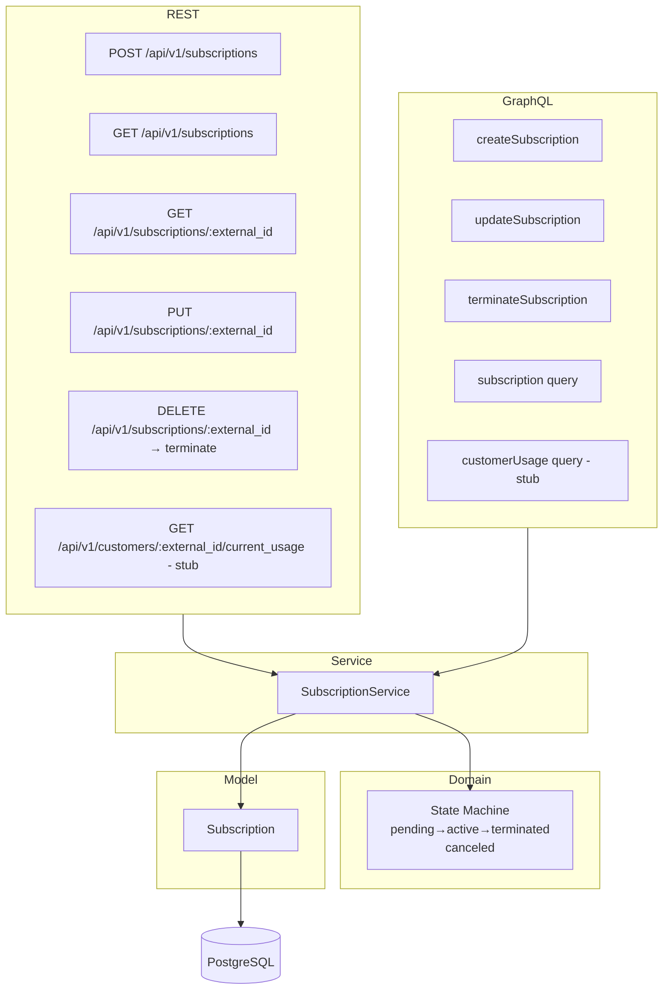
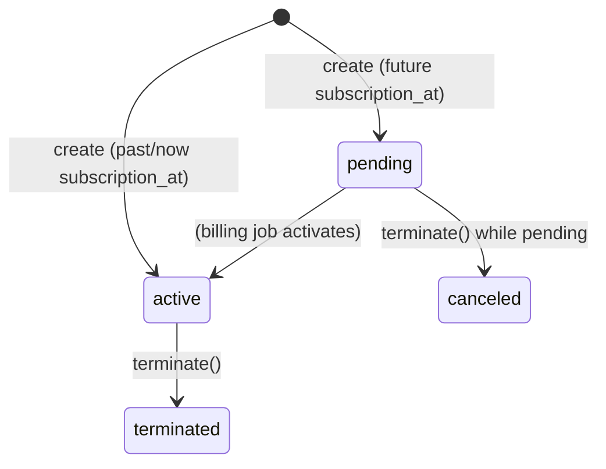

# Issue: lago-fork-1mx — Subscriptions Lifecycle, State Machine & Usage Endpoints

**Epic**: `lago-fork-7hd` (Phase 7 Customers & Subscriptions)

---

## Overview

Build the subscription domain in `api-go`: GORM model, state machine, service layer, REST endpoints, and GraphQL resolvers. The usage endpoint is a stub returning empty data for Phase 7 MVP.

---

## Architecture

---

## State Machine

---

## Task Breakdown

### T1 — DB Migration (000006_subscriptions)
- `subscriptions` table aligned with Rails schema
- Key fields: id, external_id, customer_id, plan_id, organization_id, status (int), billing_time (int), name, started_at, subscription_at, ending_at, canceled_at, terminated_at, previous_subscription_id

### T2 — GORM Model
- `internal/models/subscription.go`
- SubscriptionStatus enum (0=pending, 1=active, 2=terminated, 3=canceled)
- BillingTime enum (0=calendar, 1=anniversary)

### T3 — State Machine
- `internal/domain/subscriptions/state_machine.go`
- CanActivate, CanTerminate, CanCancel
- ApplyActivate, ApplyTerminate, ApplyCancel

### T4 — Subscription Service
- `internal/services/subscriptions/subscription_service.go`
- Interface: Create, GetByID, GetByExternalID, List, Update, Terminate
- Status auto-set on create: pending if subscription_at > now, active otherwise

### T5 — REST Handlers
- `internal/handlers/subscriptions/subscriptions.go`
- `internal/handlers/subscriptions/subscriptions_test.go`
- Wire routes in server.go

### T6 — GraphQL Resolvers
- Implement: CreateSubscription, UpdateSubscription, TerminateSubscription, Subscription query, CustomerUsage (stub)
- Update resolver.go with SubscriptionSvc

### T7 — Quality Gate
- All tests pass, build clean

---

## Execution Order

T1 → T2 → T3 → T4 → T5 → T6 → T7

---

## Notes

- `external_id` is the public identifier (customer-provided); `id` is the internal UUID.
- REST routes use `:external_id` as param (matching Rails convention).
- `subscription_at` determines when billing starts; if nil or past → status=active; if future → status=pending.
- Terminate: active→terminated (terminated_at = now); pending→canceled (canceled_at = now).
- CustomerUsage query returns empty stub (no aggregation engine in Phase 7).
- `previous_subscription_id` nullable (upgrade/downgrade flows, out of scope for Phase 7).

---

## Implementation Summary

*(To be filled after completion)*
