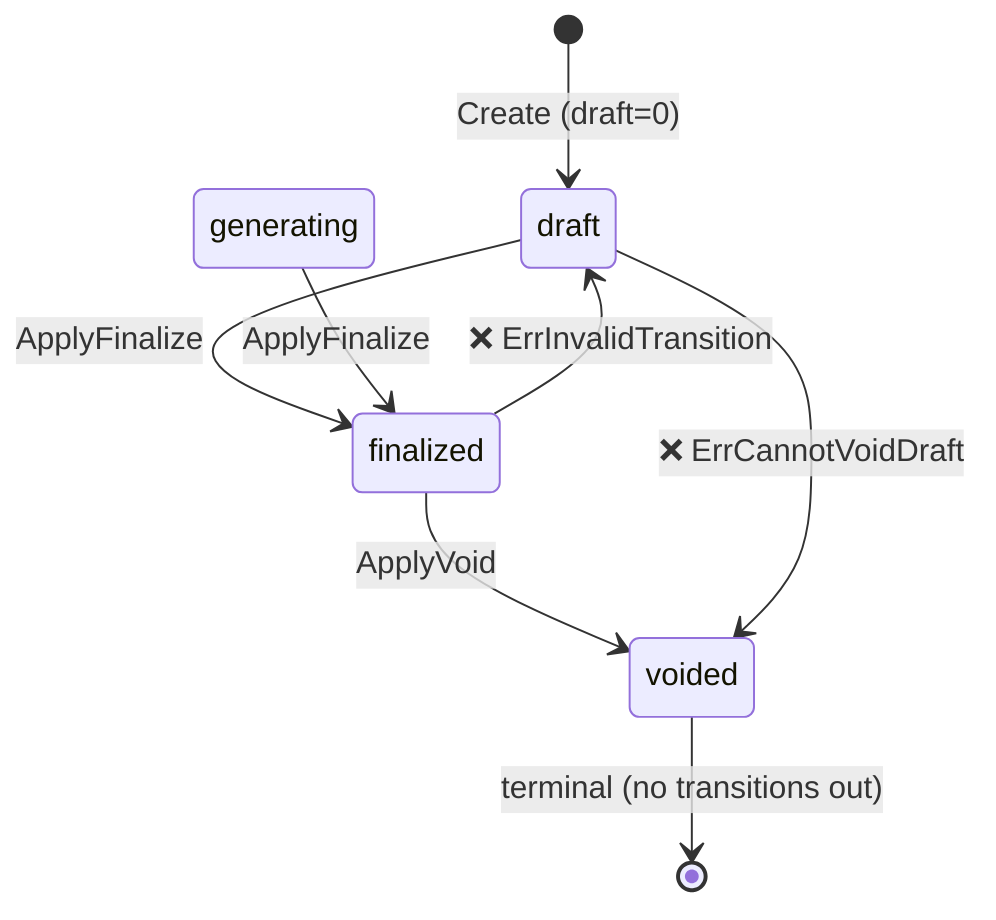

# lago-fork-9i8: Invoice Engine Core State Machine and Create Service

## Objective

Implement the invoice domain model, state machine, CRUD service, REST handlers,
and wire up routes in the Gin server. The implementation maps to the existing Rails
`invoices` table without running new migrations.

## State Transition Diagram

## Files Implemented

| File | Purpose |
|------|---------|
| `internal/models/invoice.go` | GORM model mapping Rails `invoices` table |
| `internal/domain/invoices/state_machine.go` | Pure domain transition logic |
| `internal/domain/invoices/state_machine_test.go` | Unit tests for all transitions |
| `internal/services/invoices/invoice_service.go` | Service with Create/List/GetByID/Finalize/Void |
| `internal/services/invoices/invoice_service_test.go` | Tests for pure validation/normalization helpers |
| `internal/handlers/invoices/invoices.go` | Gin handlers for all 5 endpoints |
| `internal/handlers/invoices/invoices_test.go` | Handler tests using mock service |
| `internal/server/server.go` | Routes registered under `/api/v1/invoices` |

## API Endpoints

| Method | Path | Permission |
|--------|------|-----------|
| POST | `/api/v1/invoices` | invoice:write |
| GET | `/api/v1/invoices` | invoice:read |
| GET | `/api/v1/invoices/:id` | invoice:read |
| PUT | `/api/v1/invoices/:id/finalize` | invoice:write |
| PUT | `/api/v1/invoices/:id/void` | invoice:write |

## Error Codes

| Condition | HTTP | Error Code |
|-----------|------|-----------|
| Missing required field | 422 | `validation_error` |
| Invoice not found | 404 | `invoice_not_found` |
| Invalid state transition | 422 | `transition_error` |
| Internal error | 500 | `internal_error` |
