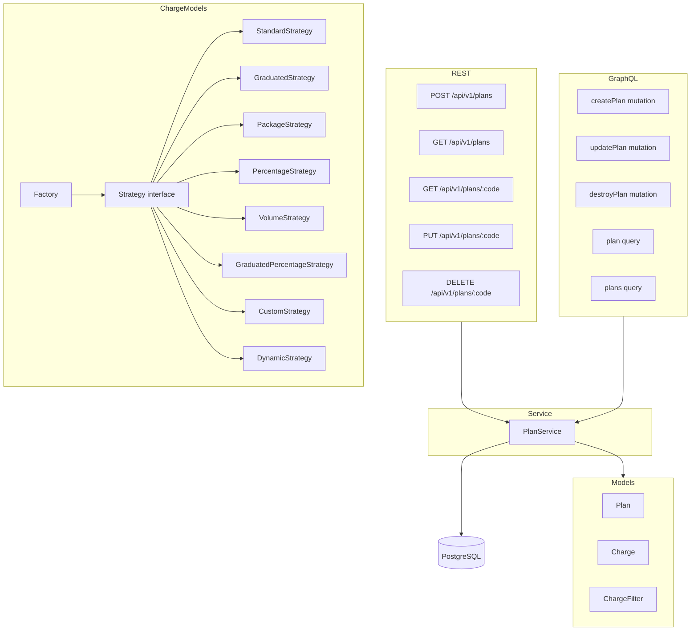

# Epic: Phase 6 Plans & Charges — Implementation Plan

**Epic ID**: `lago-fork-iql`  
**Child issues**: `lago-fork-ob2` (Plans/Charges CRUD), `lago-fork-yjt` (Charge Model Strategies)

---

## Overview

Port Lago's Plans and Charges domain from Rails to the Go `api-go` service. This delivers:
1. **Plans CRUD** — REST endpoints + GraphQL mutations/queries for plans (and their embedded charges).
2. **Eight charge model strategies** — Pure Go implementations of standard/graduated/package/percentage/volume/graduated_percentage/custom/dynamic, matching Rails output.

---

## Architecture

---

## Task Breakdown

### T1 — DB Migration (000005_plans_charges)
- `plans` table (matches Rails schema)
- `charges` table (properties as JSONB, charge_model as integer)
- `charge_filters` table (properties as JSONB)

### T2 — GORM Models
- `internal/models/plan.go` — Plan, PlanInterval enum
- `internal/models/charge.go` — Charge, ChargeModel enum
- `internal/models/charge_filter.go` — ChargeFilter

### T3 — Plan Service (lago-fork-ob2)
- `internal/services/plans/plan_service.go`
- Interface: Create, List, GetByCode, GetByID, Update, Delete
- Charges are created/updated inline with plan

### T4 — REST Handlers (lago-fork-ob2)
- `internal/handlers/plans/plans.go`
- `internal/handlers/plans/plans_test.go`
- Wire routes in `internal/server/server.go`

### T5 — GraphQL Resolvers (lago-fork-ob2)
- Implement createPlan, updatePlan, destroyPlan mutations
- Implement plan, plans queries
- Update `internal/graphql/resolver.go` to include PlanSvc

### T6 — Charge Model Strategies (lago-fork-yjt)
- `internal/chargemodels/strategy.go` — interface + Result struct
- `internal/chargemodels/standard.go`
- `internal/chargemodels/graduated.go`
- `internal/chargemodels/package.go`
- `internal/chargemodels/percentage.go`
- `internal/chargemodels/volume.go`
- `internal/chargemodels/graduated_percentage.go`
- `internal/chargemodels/custom.go`
- `internal/chargemodels/dynamic.go`
- `internal/chargemodels/factory.go`
- `internal/chargemodels/chargemodels_test.go` — parity tests

### T7 — Integration & Quality Gates
- All tests pass
- Build clean

---

## Execution Order

T1 → T2 → T3 → T4 → T5 (sequential, each depends on prior)  
T6 (parallel to T3–T5, independent)  
T7 (last)

---

## Notes

- Charges are embedded in plan create/update — no standalone charge endpoints for MVP.
- `charge_filter_values` table not needed for Phase 6 MVP (complex join table, deferred).
- ChargeFilter.Properties stored as JSONB, matching Rails.
- Charge.Properties stored as JSONB (model-specific structure).
- `dynamic` charge model: same as standard but marks the charge as externally priced.
- `custom` charge model: requires custom_agg billable metric; compute delegates to external system.

---

## Implementation Summary

*(To be filled after completion)*
