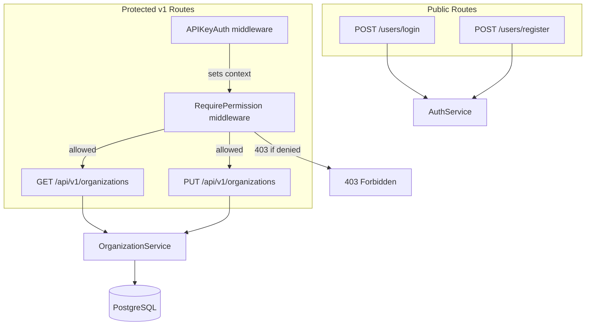
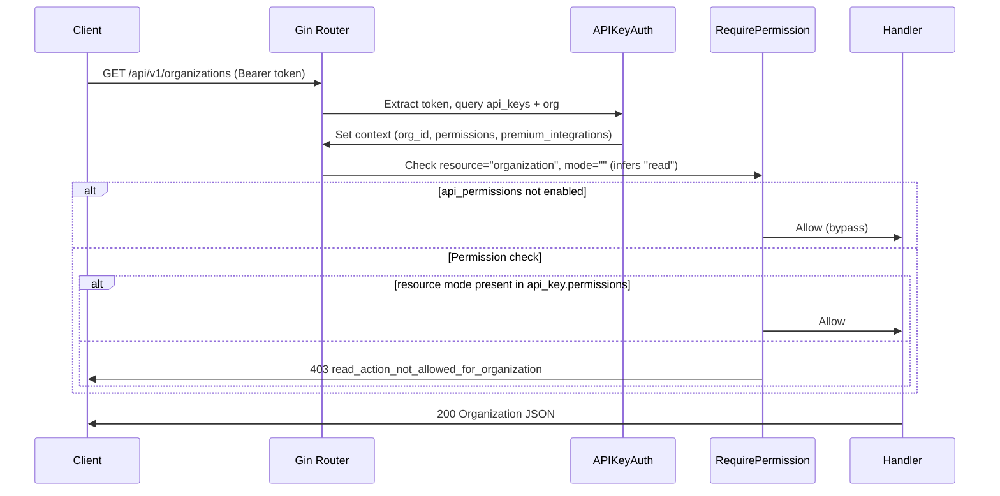
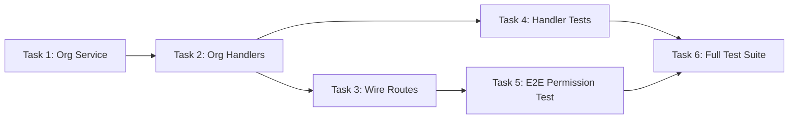

# Implementation Plan: lago-fork-k72 — Phase 2 Auth & Organization

## Overview

This epic delivers authentication, role-based access control, and organization lifecycle management for the Go API. It has two child issues:

| ID              | Title                                         | Status          |
| --------------- | --------------------------------------------- | --------------- |
| `lago-fork-gn7` | REST auth: POST /users/login, /users/register | **closed**      |
| `lago-fork-93v` | API key auth, RBAC matrix, org settings APIs  | **in-progress** |

**lago-fork-gn7** is complete (JWT login/register with bcrypt, handler tests, server wiring).

**lago-fork-93v** is the remaining work. Its scope from the issue description: _"Add API-key middleware, permission checks from permissions.yml, and membership/invite/org settings endpoints. Acceptance: unauthorized access is blocked by tests."_

### What's already done for lago-fork-93v

- `APIKeyAuth` middleware loads API key + preloads org, sets `GinKeyAPIKeyPermissions` and `GinKeyOrganizationPremiumIntegrations` into context.
- `RequirePermission(resource, mode)` middleware checks API key JSONB permissions against org `api_permissions` premium integration flag.
- 5 permission tests pass (feature-disabled bypass, read/write inference, nil-permissions allow-all, missing-resource deny).
- Context keys defined for org ID, user ID, API key ID, membership ID, permissions, premium integrations.

### What remains

1. **Organization settings REST endpoints** (GET + PUT /api/v1/organizations)
2. **Membership management** (list/update/revoke via future GraphQL; for now REST stubs or skip)
3. **Invite management** (create/accept/revoke invites; same — future GraphQL phase)
4. **API key CRUD** (create/update/destroy/rotate — future GraphQL phase)
5. **Wire RequirePermission into routes** with correct resource names
6. **End-to-end unauthorized access test** (APIKeyAuth + RequirePermission chained)

Since GraphQL infra (gqlgen) is Phase 3 (`lago-fork-598`), we focus on **REST-only endpoints** here and defer GraphQL resolvers.

---

## High-Level Architecture



### Permission Check Flow



---

## Task Breakdown

### Task 1: Organization Service Layer

**Files**: `internal/services/organizations/organization_service.go`

- `OrganizationService` interface with `Get(ctx, orgID) -> Organization` and `Update(ctx, orgID, params) -> Organization`
- Uses GORM to load/save Organization by ID
- Update accepts a params struct mirroring Rails `Organizations::UpdateService`:
  - Basic: country, timezone, email, legal_name, legal_number, tax_identification_number
  - Address: address_line1, address_line2, state, zipcode, city
  - Billing: default_currency, net_payment_term, webhook_url
  - Documents: document_numbering, document_number_prefix, finalize_zero_amount_invoice
  - Settings: email_settings, invoice_footer, invoice_grace_period, document_locale

### Task 2: Organization REST Handlers

**Files**: `internal/handlers/organizations/organizations.go`

- `Show(svc)` → GET handler reads `GinKeyOrganizationID` from context, calls service, serializes response
- `Update(svc)` → PUT handler binds JSON body, calls service, returns updated org
- Response shape matches Rails V1::OrganizationSerializer

### Task 3: Wire Routes with RequirePermission

**Files**: `internal/server/server.go`

- Add organization routes inside the v1 group:
  ```go
  orgs := v1.Group("/organizations")
  orgs.GET("", middleware.RequirePermission("organization", ""), handlers.Show(orgSvc))
  orgs.PUT("", middleware.RequirePermission("organization", ""), handlers.Update(orgSvc))
  ```

### Task 4: Organization Handler Tests

**Files**: `internal/handlers/organizations/organizations_test.go`

- Test Show returns 200 with org data
- Test Update returns 200 with updated fields
- Test Update with invalid data returns 422
- Mock service layer using interface

### Task 5: End-to-End Permission Integration Test

**Files**: `internal/middleware/integration_test.go`

- Chain APIKeyAuth + RequirePermission on a test route
- Verify: key with `organization:["read"]` → 200 on GET, 403 on PUT
- Verify: key without `organization` → 403 on GET
- Verify: org without api_permissions premium integration → 200 (bypass)
- Uses sqlmock for DB layer

### Task 6: Run Full Test Suite & Validate Build

- `go build ./...` must pass
- `go test ./...` must pass
- All existing middleware/handler/model tests remain green

---

## Dependencies Between Tasks



### Notes

- **Task 1** is independent — pure service layer with no HTTP concerns.
- **Task 2** depends on Task 1 (uses service interface).
- **Task 3** depends on Task 2 (registers handlers on routes).
- **Task 4** can run in parallel with Task 3 (tests use mock service, not real routes).
- **Task 5** depends on Task 3 (needs full route chain wired).
- **Task 6** is the final gate — run after all other tasks.

---

## Execution Order

1. **Task 1** — Implement OrganizationService (Get + Update)
2. **Task 2** — Implement Organization REST handlers (Show + Update)
3. **Task 3 + Task 4** (parallel) — Wire routes in server.go AND write handler tests
4. **Task 5** — End-to-end permission integration test
5. **Task 6** — Full build + test validation

---

## Out of Scope (deferred to later phases)

| Feature                                               | Deferred To             | Reason                |
| ----------------------------------------------------- | ----------------------- | --------------------- |
| Membership GraphQL mutations (update/revoke)          | Phase 3 (lago-fork-598) | Requires gqlgen       |
| Invite GraphQL mutations (create/accept/revoke)       | Phase 3                 | Requires gqlgen       |
| API key CRUD mutations (create/update/destroy/rotate) | Phase 3                 | Requires gqlgen       |
| Roles CRUD                                            | Phase 3                 | GraphQL-only in Rails |
| Organization logo upload                              | Future                  | Needs file storage    |
| Admin endpoints (/admin/organizations)                | Future                  | Separate auth flow    |

## Key Considerations

1. **Strangler Fig**: The Go service shares the same PostgreSQL database as Rails. Organization updates must not break Rails read paths. Use only columns that already exist in `structure.sql`.
2. **Serializer parity**: Response JSON should match Rails `V1::OrganizationSerializer` shape so frontend can switch backends transparently.
3. **Permission resource name**: Rails uses `"organization"` as the resource name for `RequirePermission`. The Go middleware already has this in `apiKeyResources`.
4. **Update validation**: Rails validates country codes, currency codes, locale, timezone. Go should replicate these validations at the service layer.
