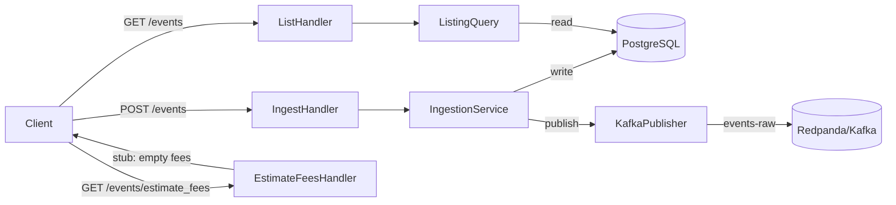

# Plan: lago-fork-tzr — Events Listing, Estimate Fees & Kafka Publishing

## Overview

Implement three features for the Go API (api-go):

1. **GET /api/v1/events** — Paginated listing with filters (code, external_subscription_id, timestamp_from, timestamp_to, page, per_page)
2. **GET /api/v1/events/estimate_fees** — Stub fee estimation (returns empty fees; full logic requires Phase 5 subscriptions/charges)
3. **Kafka raw-events publishing** — Publish to `events-raw` topic after successful event ingestion using `franz-go` (same client as events-processor)

## Architecture



## Key Design Decisions

- **franz-go** (github.com/twmb/franz-go) — consistent with events-processor
- **EventPublisher interface** + NoopPublisher for tests/disabled Kafka — DI pattern
- **Kafka publish is fire-and-forget with logging** — producer failures are observable via slog but do NOT block ingestion response (async, best-effort)
- **estimate_fees** is a validated stub — validates required fields, returns `{"fees": []}` since subscriptions/charges aren't available until Phase 5
- **Pagination** — cursor-less offset pagination with meta envelope matching Rails response shape

## Files to Create

| File | Purpose |
|------|---------|
| `api-go/internal/kafka/producer.go` | EventPublisher interface, KafkaPublisher, NoopPublisher |
| `api-go/internal/kafka/producer_test.go` | NoopPublisher test |

## Files to Modify

| File | Changes |
|------|---------|
| `api-go/go.mod` | Add `github.com/twmb/franz-go` |
| `api-go/config/config.go` | Add KafkaBootstrapServers, KafkaRawEventsTopic, KafkaTLS, KafkaScramAlgorithm, KafkaUsername, KafkaPassword |
| `api-go/internal/services/events/ingestion_service.go` | Inject EventPublisher; publish after successful create |
| `api-go/internal/services/events/ingestion_service_test.go` | Ensure tests pass with NoopPublisher |
| `api-go/internal/handlers/events/events.go` | Add List and EstimateFees handlers |
| `api-go/internal/handlers/events/events_test.go` | Add List and EstimateFees handler tests |
| `api-go/internal/server/server.go` | Register GET /events, GET /events/estimate_fees; wire KafkaPublisher |
| `api-go/cmd/api/main.go` | Initialize KafkaPublisher (or Noop when not configured) |

## Kafka Message Format

Matches events-processor `models.Event` struct exactly:

```json
{
  "organization_id": "org-123",
  "external_subscription_id": "",
  "transaction_id": "txn-789",
  "code": "api_calls",
  "properties": {},
  "precise_total_amount_cents": "",
  "source": "http_go",
  "timestamp": 1710000000.0,
  "source_metadata": { "api_post_processed": false, "reprocess": false },
  "ingested_at": "2024-03-17T13:00:00.000Z"
}
```

## Todos

1. Add franz-go to go.mod (`go get github.com/twmb/franz-go@v1.20.5`)
2. Add Kafka fields to config.go
3. Create `internal/kafka/producer.go` with EventPublisher interface
4. Modify ingestion_service.go to accept + call EventPublisher
5. Update ingestion_service_test.go (pass NoopPublisher)
6. Add List + EstimateFees handlers to events.go
7. Add handler tests
8. Register routes + wire Kafka in server.go
9. Update cmd/api/main.go to init Kafka
10. Run `go test ./...` — must pass

## Implementation Notes

- Kafka publish errors log at WARN but don't fail the request (observable, retriable by processor dead-letter flow)
- Listing returns events scoped to the authenticated organization
- `timestamp_from` / `timestamp_to` filter on `events.timestamp` column
- Per-page default: 20; max: 100
