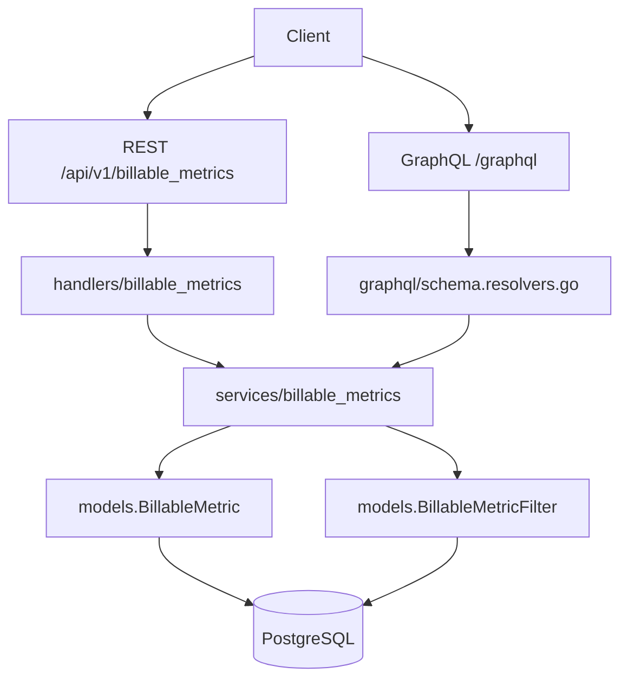

# Plan: lago-fork-xqr — Phase 5 Billable Metrics CRUD

## Overview

Implement full CRUD for Billable Metrics in `api-go` covering:

- **lago-fork-f3g**: REST CRUD (`/api/v1/billable_metrics`) with nested filter management
- **lago-fork-hdx**: GraphQL resolvers for queries + mutations + expression/aggregation validation

Rails schema is the source of truth for DB column parity. `aggregation_type` stored as integer; `rounding_function` and `weighted_interval` stored as TEXT (avoid PG enum conflicts across Rails/Go migrations).

## Architecture

## Tasks

1. **Migration 000004** – `billable_metrics` + `billable_metric_filters` tables
2. **Models** – `BillableMetric`, `BillableMetricFilter` GORM structs
3. **Service** – interface + CRUD implementation (create, list, get, update, delete) with filter sync
4. **REST Handlers** – Gin handlers (create, index, show, update, destroy)
5. **Server wiring** – register routes in `server.go`
6. **GraphQL Resolvers** – implement 5 stubs (BillableMetric, BillableMetrics, CreateBillableMetric, UpdateBillableMetric, DestroyBillableMetric)
7. **Tests** – handler tests (mock service) + service unit/integration, GraphQL resolver tests

## REST Endpoints

| Method | Path | Handler |
|--------|------|---------|
| POST | `/api/v1/billable_metrics` | Create |
| GET | `/api/v1/billable_metrics` | Index |
| GET | `/api/v1/billable_metrics/:code` | Show |
| PUT | `/api/v1/billable_metrics/:code` | Update |
| DELETE | `/api/v1/billable_metrics/:code` | Destroy |

## Validation Rules

- `name` required
- `code` required, unique per org (soft-delete aware)
- `aggregation_type` must be valid
- `field_name` required unless `count_agg` or `custom_agg`
- `weighted_interval` required for `weighted_sum_agg`
- `expression` validated if present (non-empty expression check)
- `recurring` incompatible with `count_agg`, `max_agg`, `latest_agg`

## Summary (post-implementation)

_To be filled after completion._
