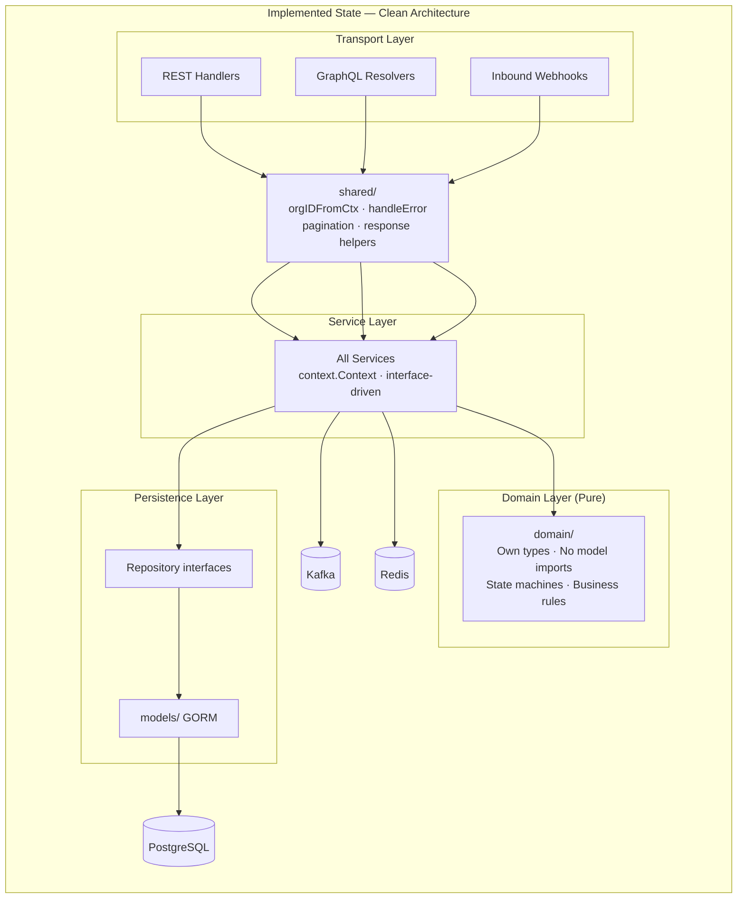
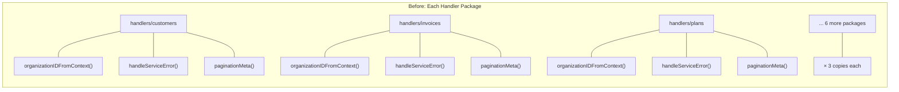
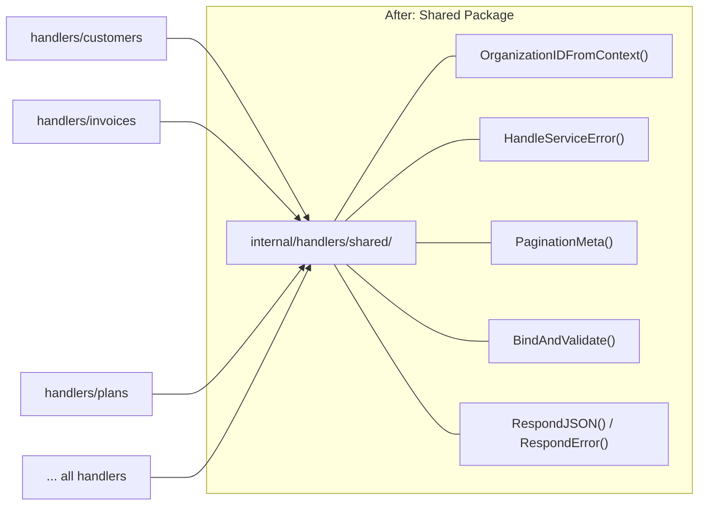
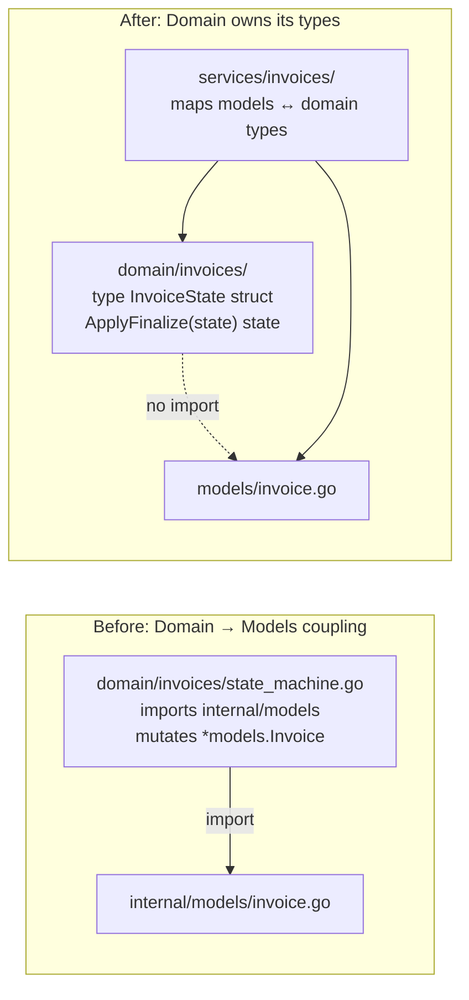
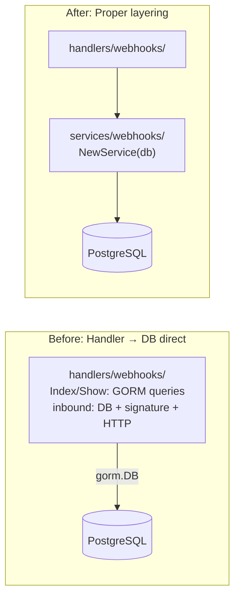
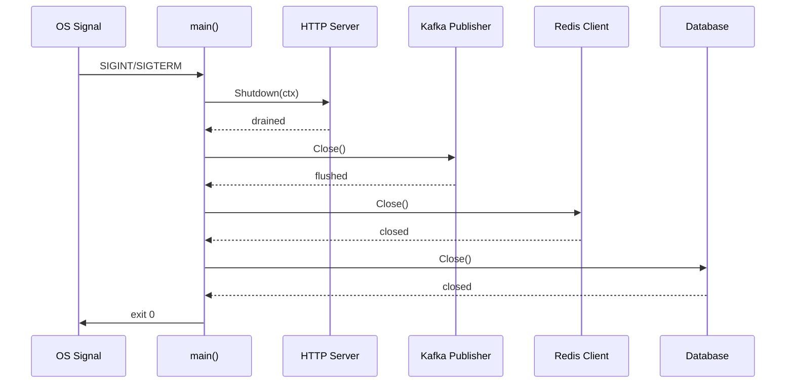
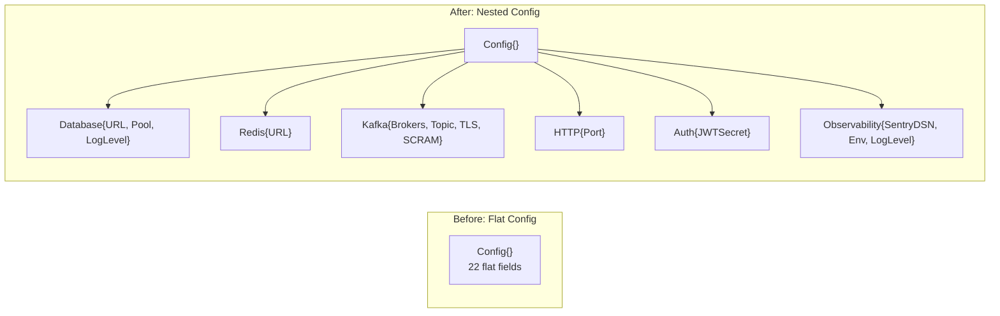
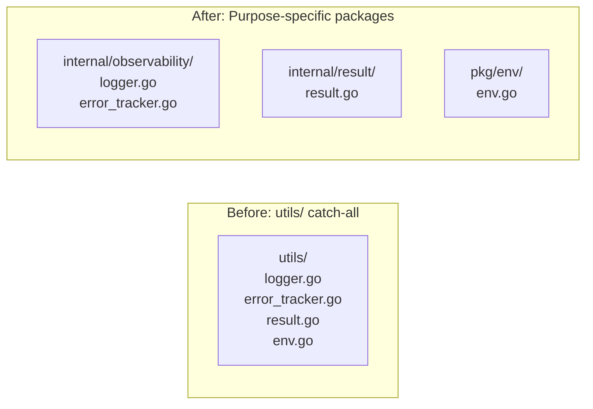
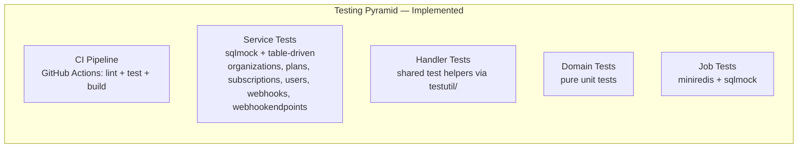

# api-go — Enhancement Plan

> **Status: ALL 7 ENHANCEMENT AREAS COMPLETED — March 2026**

## Executive Summary

After a thorough analysis of the `api-go` codebase, this document outlined **7 enhancement areas** prioritized by impact. All areas have been fully implemented. The codebase had a solid foundation (clean layered architecture, strategy pattern, interface-driven DI), and has now been improved to eliminate **cross-cutting duplication**, **inconsistent conventions**, **architecture boundary violations**, and **gaps in testing and CI**.

---

## Implemented Architecture



---

## Enhancement Areas

### Area 1: Extract Shared Handler Utilities — COMPLETED

**Priority: HIGH — Quick Win**

**Problem solved:** 9 nearly identical copies of `organizationIDFromContext`, duplicated `handleServiceError` switch blocks, and duplicated `paginationMeta` helpers across every handler package.

**Before:**



**After:**



**Completed tasks:**

- [x] Created `internal/handlers/shared/` package with `context.go`, `errors.go`, `pagination.go`, `response.go`
- [x] Refactored all 9 handler packages to use the shared package
- [x] Deleted all local copies

---

### Area 2: Standardize HTTP Response Conventions — COMPLETED

**Priority: HIGH — API Consistency**

**Problem solved:** Two incompatible error response shapes, mixed 200/201 for Create, and inconsistent unauthorized payloads.

| Issue | Before | After |
|-------|---------|--------|
| Error format (most handlers) | `{"status":"error","error_code":"...","error_details":{}}` | Standard (kept) |
| Error format (webhooks/webhook_endpoints) | `{"error":"..."}` | Migrated to standard format |
| Create status code (customers, invoices, plans, billable_metrics, events) | `200 OK` | `201 Created` |
| Create status code (subscriptions, auth, webhook_endpoints) | `201 Created` | Kept |
| List error handling | Generic 500 without `handleServiceError` | Routes through `HandleServiceError` |
| Unauthorized format | Two different shapes | Single standard shape |

**Completed tasks:**

- [x] Defined canonical error envelope type in `internal/handlers/shared/errors.go`
- [x] Fixed all Create handlers to return `201 Created`
- [x] Updated webhooks/webhook_endpoints to use the standard error format
- [x] Routed all List handler errors through `HandleServiceError`

---

### Area 3: Fix Architecture Boundary Violations — COMPLETED

**Priority: HIGH — Structural Integrity**

**Problem solved:** The domain layer imported `internal/models` (GORM types), and webhook handlers bypassed the service layer entirely.





**Completed tasks:**

- [x] Created pure domain types in `domain/invoices/types.go` and `domain/subscriptions/types.go` — no `models` import
- [x] Refactored state machines to operate on domain types; service layer maps between GORM models and domain types
- [x] Created `internal/services/webhooks/webhook_service.go` with `List` and `GetByID` methods
- [x] Created `internal/services/webhooks/inbound_service.go` extracting signature verification and DB logic
- [x] Updated `server.go` DI wiring: new webhook services, missing services wired to GraphQL Resolver

---

### Area 4: Fix Resource Lifecycle & Production Readiness — COMPLETED

**Priority: HIGH — Reliability**

**Problem solved:** Resource leaks and missing cleanup in the application lifecycle.

| Resource | Issue | Fix Applied |
|----------|-------|-------------|
| Kafka publisher | Created in `cmd/api/main.go` but `Close()` never called | `defer publisher.Close()` in graceful shutdown |
| Redis client | `NewRedisDB` return discarded, never closed | Stored reference, `defer client.Close()` |
| HTTP response body | `defer resp.Body.Close()` without drain in webhook handler | Added `io.Copy(io.Discard, resp.Body)` before close |
| Config validation | `DATABASE_URL` can be empty, crashes at runtime | Validates required config at startup, fails fast |
| Health endpoint | `/ready` exposes raw `err.Error()` | Sanitized to "database not ready" |

**Graceful shutdown sequence:**



---

### Area 5: Standardize Naming & Package Conventions — COMPLETED

**Priority: MEDIUM — Developer Experience**

**Problem solved:** Inconsistent package naming, directory naming, test package conventions, and dead code.

| Before | After |
|---------|--------|
| Dir `handlers/webhook_endpoints/` → pkg `webhook_endpoints` | Dir `handlers/webhookendpoints/` → pkg `webhookendpoints` |
| Dir `handlers/billable_metrics/` → pkg `billablemetrics` (mismatch) | Dir `handlers/billablemetrics/` → pkg `billablemetrics` |
| `internal/chargemodels/package.go` (confusing filename) | `internal/chargemodels/chargemodels.go` |
| `internal/models/fee.go` has unused `JSONBObject` | Removed |
| `internal/graphql/dataloaders/` (wired but never used) | Deleted |
| `GraphQLRequireAuth` (never called) | Deleted |
| Test files: mix of `package X` and `package X_test` | Standardized on `package X_test` |

**Completed tasks:**

- [x] Renamed directories to match Go convention (no underscores)
- [x] Removed dead code (`JSONBObject`, `dataloaders/`, `GraphQLRequireAuth`, `GraphQLDataLoaders` middleware)
- [x] Standardized test package naming to `_test` suffix (customers, events services)
- [x] Renamed `package.go` to `chargemodels.go`

---

### Area 6: Improve Config & Utils Organization — COMPLETED

**Priority: MEDIUM — Maintainability**

**Problem solved:** Flat config struct, utils as a catch-all, and config duplicating env parsing.

**Config restructure:**



**Utils refactor:**



**Completed tasks:**

- [x] Restructured `Config` into nested sub-configs with validation (`Validate()` called at startup)
- [x] Moved Sentry/logging to `internal/observability/`
- [x] Moved `Result[T]` to `internal/result/`
- [x] Moved env helpers to `pkg/env/` and reused in config
- [x] Removed `LogAndPanic`; deleted `utils/` directory
- [x] Split `organization.go` god model into `billing_entity.go` and `password_reset.go`

---

### Area 7: Testing & CI Foundation — COMPLETED

**Priority: MEDIUM — Long-term Quality**

**Problem solved:** No CI pipeline, no integration tests, hand-written mocks, missing service tests.



**Completed tasks:**

- [x] Created `.github/workflows/api-go-ci.yml` (lint, test, build triggered on `api-go/` path changes)
- [x] Created `.golangci.yml` with linters: `gofmt`, `govet`, `errcheck`, `staticcheck`, `gosimple`, `unused`, `ineffassign`
- [x] Created `internal/testutil/` with `router.go`, `db.go`, `fixtures.go`
- [x] Added missing service tests: `organizations`, `plans`, `subscriptions`, `users`, `webhookendpoints`, `webhooks`
- [x] Added `context.Context` to `webhookendpoints` service interface and all methods

---

## Summary Matrix

| # | Area | Priority | Effort | Impact | Status |
|---|------|----------|--------|--------|--------|
| 1 | Extract shared handler utils | HIGH | S (2-3d) | HIGH | DONE |
| 2 | Standardize HTTP responses | HIGH | S (2d) | HIGH | DONE |
| 3 | Fix architecture boundaries | HIGH | M (5d) | HIGH | DONE |
| 4 | Fix resource lifecycle | HIGH | S (2d) | CRITICAL | DONE |
| 5 | Naming & package conventions | MED | S (3d) | MED | DONE |
| 6 | Config & utils reorg | MED | S (3d) | MED | DONE |
| 7 | Testing & CI | MED | M (5d) | HIGH | DONE |

---

## Current Folder + File Structure

```
api-go/
├── .air.toml
├── .env.dist
├── .golangci.yml                                    # linter config
├── .github/
│   └── workflows/
│       └── api-go-ci.yml                            # lint + test + build
├── Dockerfile
├── Dockerfile.dev
├── Makefile
├── go.mod / go.sum
├── gqlgen.yml
├── schema.graphql
│
├── cmd/
│   ├── api/
│   │   └── main.go                                  # graceful shutdown: HTTP + Kafka + Redis + DB
│   └── worker/
│       └── main.go
│
├── config/
│   ├── config.go                                    # nested sub-configs + Validate()
│   ├── database/
│   │   └── database.go
│   └── redis/
│       └── redis.go
│
├── pkg/
│   └── env/
│       └── env.go                                   # GetEnvOrDefault, GetEnvAsInt
│
├── internal/
│   ├── server/
│   │   ├── server.go
│   │   └── server_test.go
│   │
│   ├── middleware/
│   │   ├── auth.go
│   │   ├── auth_test.go
│   │   ├── context_keys.go
│   │   ├── graphql.go                               # GraphQLRequireAuth removed
│   │   ├── graphql_test.go
│   │   ├── logging.go
│   │   ├── permissions.go
│   │   ├── permissions_test.go
│   │   ├── recovery.go
│   │   └── recovery_test.go
│   │
│   ├── handlers/
│   │   ├── shared/                                  # extracted shared utilities
│   │   │   ├── context.go                           # OrganizationIDFromContext
│   │   │   ├── errors.go                            # HandleServiceError, error envelope type
│   │   │   ├── pagination.go                        # PaginationMeta
│   │   │   └── response.go                          # RespondJSON, RespondError
│   │   ├── health.go                                # sanitized error output
│   │   ├── health_test.go
│   │   ├── auth/
│   │   │   ├── login.go
│   │   │   ├── register.go
│   │   │   └── auth_test.go
│   │   ├── billablemetrics/                         # renamed from billable_metrics/
│   │   │   ├── billable_metrics.go                  # uses shared/, 201 on Create
│   │   │   └── billable_metrics_test.go
│   │   ├── customers/
│   │   │   ├── customers.go                         # uses shared/, 201 on Create
│   │   │   └── customers_test.go
│   │   ├── events/
│   │   │   ├── events.go                            # uses shared/, 201 on Create
│   │   │   └── events_test.go
│   │   ├── invoices/
│   │   │   ├── invoices.go                          # uses shared/, 201 on Create
│   │   │   └── invoices_test.go
│   │   ├── organizations/
│   │   │   ├── organizations.go                     # uses shared/ (no inline extraction)
│   │   │   └── organizations_test.go
│   │   ├── plans/
│   │   │   ├── plans.go                             # uses shared/, 201 on Create
│   │   │   └── plans_test.go
│   │   ├── subscriptions/
│   │   │   ├── subscriptions.go                     # uses shared/
│   │   │   └── subscriptions_test.go
│   │   ├── webhookendpoints/                        # renamed from webhook_endpoints/
│   │   │   ├── webhook_endpoints.go                 # standard error format, uses shared/
│   │   │   └── webhook_endpoints_test.go
│   │   └── webhooks/
│   │       ├── webhooks.go                          # delegates to service (no GORM)
│   │       └── inbound.go                           # delegates to inbound service
│   │
│   ├── services/
│   │   ├── billablemetrics/                         # renamed from billable_metrics/
│   │   │   ├── billable_metric_service.go
│   │   │   └── billable_metric_service_test.go
│   │   ├── customers/
│   │   │   ├── customer_service.go
│   │   │   └── customer_service_test.go             # package customers_test
│   │   ├── events/
│   │   │   ├── ingestion_service.go
│   │   │   └── ingestion_service_test.go            # package events_test
│   │   ├── invoices/
│   │   │   ├── invoice_service.go
│   │   │   └── invoice_service_test.go
│   │   ├── organizations/
│   │   │   ├── organization_service.go
│   │   │   └── service_test.go
│   │   ├── plans/
│   │   │   ├── plan_service.go
│   │   │   └── service_test.go
│   │   ├── subscriptions/
│   │   │   ├── subscription_service.go
│   │   │   └── service_test.go
│   │   ├── users/
│   │   │   ├── auth_service.go
│   │   │   └── service_test.go
│   │   ├── webhookendpoints/                        # renamed from webhook_endpoints/
│   │   │   ├── webhook_endpoint_service.go          # adds context.Context to all methods
│   │   │   └── service_test.go
│   │   └── webhooks/
│   │       ├── webhook_service.go                   # List, GetByID (Area 3)
│   │       ├── inbound_service.go                   # signature verify + DB logic (Area 3)
│   │       ├── webhook_dispatch_service.go
│   │       └── service_test.go
│   │
│   ├── domain/
│   │   ├── invoices/
│   │   │   ├── types.go                             # pure domain types (no models import)
│   │   │   ├── state_machine.go                     # operates on domain types
│   │   │   ├── state_machine_test.go
│   │   │   ├── totals.go
│   │   │   └── totals_test.go
│   │   └── subscriptions/
│   │       ├── types.go                             # pure domain types (no models import)
│   │       ├── state_machine.go                     # operates on domain types
│   │       └── state_machine_test.go
│   │
│   ├── chargemodels/
│   │   ├── chargemodels.go                          # strategy interface + factory (renamed from package.go)
│   │   ├── chargemodels_test.go
│   │   ├── aggregated/
│   │   │   ├── package.go
│   │   │   └── percentage.go
│   │   ├── base/
│   │   │   ├── helpers.go
│   │   │   └── types.go
│   │   ├── flat/
│   │   │   ├── custom.go
│   │   │   ├── dynamic.go
│   │   │   └── standard.go
│   │   └── tiered/
│   │       ├── graduated.go
│   │       ├── graduated_percentage.go
│   │       └── volume.go
│   │
│   ├── graphql/
│   │   ├── resolver.go                              # all services wired
│   │   ├── schema.resolvers.go
│   │   ├── errors.go
│   │   ├── generated/
│   │   │   └── generated.go
│   │   ├── model/
│   │   │   └── models_gen.go
│   │   ├── graphcontext/
│   │   │   └── context.go
│   │   └── pagination/
│   │       ├── cursor.go
│   │       └── cursor_test.go
│   │   # dataloaders/ REMOVED (unused dead code)
│   │
│   ├── jobs/
│   │   ├── runtime.go
│   │   ├── runtime_test.go
│   │   └── handlers/
│   │       ├── event_handlers.go
│   │       ├── invoice_handlers.go
│   │       ├── invoice_handlers_test.go
│   │       ├── payment_handlers.go
│   │       ├── webhook_handlers.go                  # drains body before close
│   │       └── webhook_handlers_test.go
│   │
│   ├── kafka/
│   │   ├── producer.go
│   │   └── producer_test.go
│   │
│   ├── models/
│   │   ├── base.go
│   │   ├── api_key.go
│   │   ├── billable_metric.go
│   │   ├── billing_entity.go                        # extracted from organization.go
│   │   ├── charge.go
│   │   ├── charge_filter.go
│   │   ├── customer.go
│   │   ├── event.go
│   │   ├── fee.go                                   # JSONBObject removed
│   │   ├── invite.go
│   │   ├── invoice.go
│   │   ├── models_test.go
│   │   ├── organization.go                          # BillingEntity/PasswordReset split out
│   │   ├── password_reset.go                        # extracted from organization.go
│   │   ├── plan.go
│   │   ├── role.go
│   │   ├── subscription.go
│   │   ├── user.go
│   │   └── webhook.go
│   │
│   ├── observability/                               # extracted from utils/
│   │   ├── logger.go
│   │   └── error_tracker.go
│   │
│   ├── result/                                      # extracted from utils/
│   │   └── result.go
│   │
│   └── testutil/
│       ├── router.go                                # shared mock router builder
│       ├── db.go                                    # shared sqlmock setup
│       └── fixtures.go                              # shared test data factories
│
├── migrations/
│   ├── 000001_initial.up.sql / .down.sql
│   ├── 000002_identity_domain.up.sql / .down.sql
│   ├── 000003_events_ingestion.up.sql / .down.sql
│   ├── 000004_billable_metrics.up.sql / .down.sql
│   ├── 000005_plans_charges.up.sql / .down.sql
│   ├── 000006_subscriptions.up.sql / .down.sql
│   ├── 000007_fees.up.sql / .down.sql
│   ├── 000008_webhooks.up.sql / .down.sql
│   └── 000009_inbound_webhooks.up.sql / .down.sql
│
# utils/ REMOVED — contents moved to pkg/env/, internal/observability/, internal/result/
```

---

## Change Summary

| Change Type | Count | Details |
|-------------|-------|---------|
| **New packages** | 6 | `handlers/shared/`, `pkg/env/`, `internal/observability/`, `internal/result/`, `internal/testutil/`, `.github/workflows/` |
| **New files** | ~18 | Shared utils, domain types, extracted models, missing service tests, CI config |
| **Renamed dirs** | 4 | `billable_metrics/` → `billablemetrics/`, `webhook_endpoints/` → `webhookendpoints/` (both handlers + services), `package.go` → `chargemodels.go` |
| **Removed** | 4 | `dataloaders/` (unused), `JSONBObject` (dead code), `utils/` (deprecated, contents moved), `GraphQLRequireAuth` |
| **Changed** | ~25 | Handlers use shared/, services add context, domain decoupled, resource cleanup, 201 status codes |
