# api-go — Project Summary

## What It Is

`api-go` is the **Go-native backend service** of the [Lago](https://github.com/getlago/lago) open-source usage-based billing platform. It is a **partial Go re-implementation** of the Lago Rails API, designed to handle high-throughput paths (event ingestion, billing operations) with better performance while sharing the same PostgreSQL database with the Ruby/Rails monolith.

---

## Technology Stack

| Concern | Technology |
|---|---|
| Language | Go 1.24 |
| HTTP Framework | Gin (`gin-gonic/gin`) |
| GraphQL | gqlgen (code-generated) |
| ORM | GORM + pgx/v5 (Postgres) |
| Background Jobs | Asynq (Redis-backed) |
| Message Streaming | Kafka via `franz-go` |
| Auth | API Key (Bearer) + JWT |
| Observability | `slog`, Sentry, OpenTelemetry |
| Testing | `testify`, `go-sqlmock`, `miniredis` |

---

## High-Level Architecture

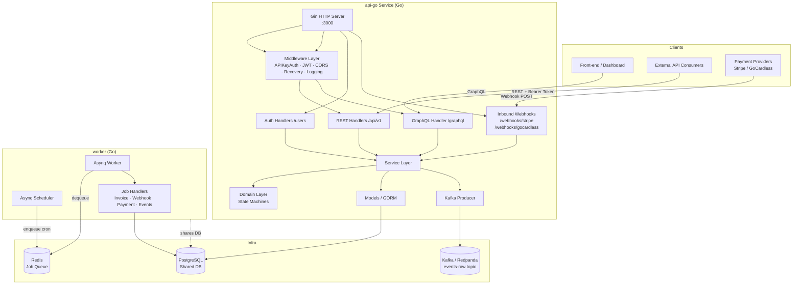

---

## File & Folder Structure

```
api-go/
├── cmd/
│   ├── api/main.go          # HTTP server entry point
│   └── worker/main.go       # Asynq background worker entry point
├── config/
│   ├── config.go            # Env-var-based Config struct
│   ├── database/database.go # GORM + pgx connection pool
│   └── redis/redis.go       # go-redis connection
├── internal/
│   ├── server/server.go     # Gin engine wiring + all routes
│   ├── middleware/          # Auth, permissions, logging, recovery, GraphQL
│   ├── models/              # GORM models (shared schema with Rails)
│   ├── handlers/            # HTTP handlers (one sub-package per resource)
│   ├── services/            # Business logic services
│   ├── domain/              # Pure domain logic (state machines, totals)
│   ├── chargemodels/        # Charge calculation strategies (Strategy pattern)
│   ├── graphql/             # gqlgen resolver + generated code + dataloaders
│   ├── jobs/                # Asynq runtime, scheduler, mux
│   │   └── handlers/        # Job handler functions
│   └── kafka/               # Kafka producer (EventPublisher interface)
├── migrations/              # SQL migration files (up/down)
├── utils/                   # Logger, Sentry error tracker, Result type
├── schema.graphql           # GraphQL schema (source of truth for gqlgen)
├── gqlgen.yml               # gqlgen code-gen configuration
├── go.mod / go.sum
├── Makefile
├── Dockerfile / Dockerfile.dev
└── .env.dist                # Environment variable reference
```

---

## Module & Feature Details

### 1. HTTP API (`internal/server` + `internal/handlers`)

Two API surfaces exist:

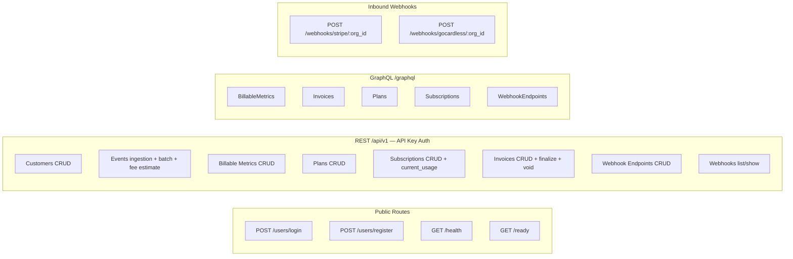

### 2. Authentication & Authorization

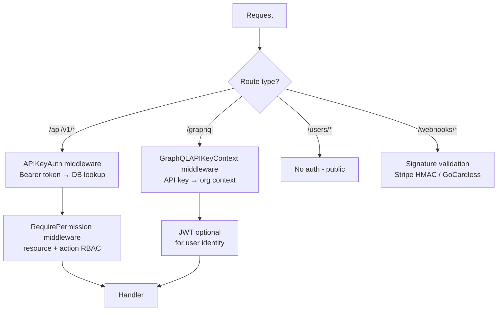

- **API keys** stored in `api_keys` table with scoped permissions JSON
- **JWT tokens** issued on login/register (used by GraphQL / dashboard)
- **RBAC**: `RequirePermission(resource, action)` middleware on every route

### 3. Domain Layer (`internal/domain`)

Pure Go domain logic with no framework dependencies.

**Invoice State Machine:**

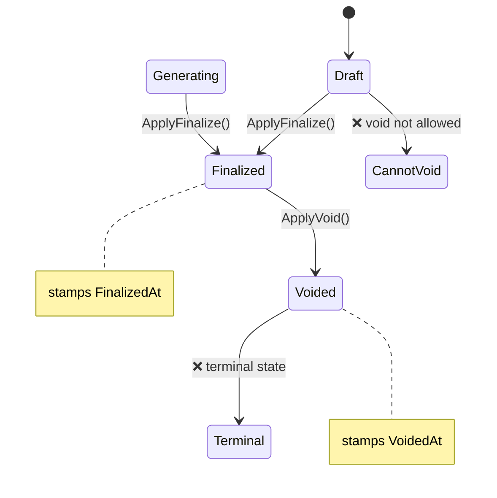

**Subscription State Machine:**

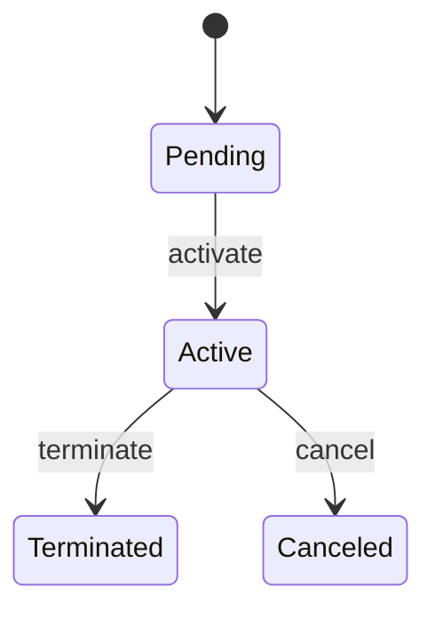

### 4. Charge Models (`internal/chargemodels`)

Strategy pattern with 8 implementations:

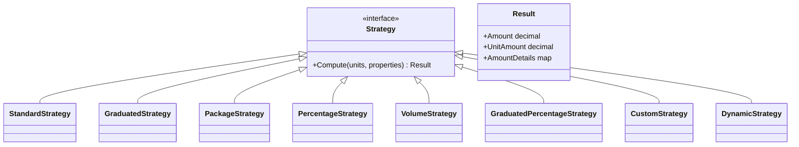

| Model | Description |
|---|---|
| `standard` | Flat per-unit price |
| `graduated` | Tiered pricing with price ranges |
| `package` | Per-package bulk pricing |
| `percentage` | % of transaction value |
| `volume` | Volume-based (all units at same tier price) |
| `graduated_percentage` | Tiered percentage |
| `custom` | Custom aggregator expression |
| `dynamic` | Dynamic unit price from event properties |

### 5. Event Ingestion & Kafka

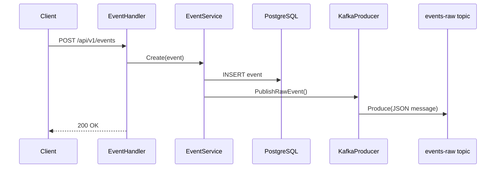

- Events are stored in PostgreSQL **and** published to Kafka
- `EventPublisher` interface → `KafkaPublisher` or `NoopPublisher` (when Kafka not configured)
- Supports SCRAM-SHA-256/512 authentication and TLS

### 6. Background Jobs (`internal/jobs`)

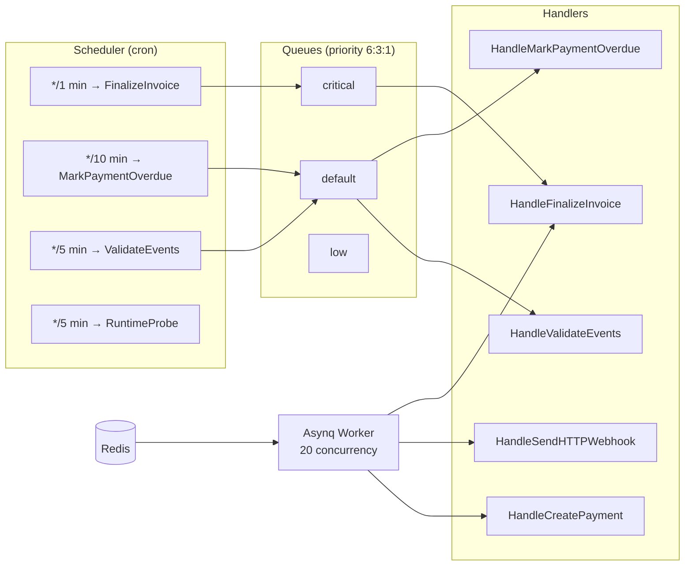

### 7. Data Models (`internal/models`)

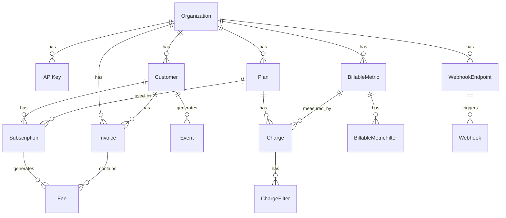

### 8. GraphQL Layer (`internal/graphql`)

- **Schema-first** with gqlgen code generation (`schema.graphql` → `generated/generated.go`)
- **DataLoaders** via `graph-gophers/dataloader` (prevents N+1 queries)
- **Cursor-based pagination** (`internal/graphql/pagination`)
- `graphcontext` package extracts org/user identity from the request context
- `ErrorPresenter` maps domain errors to GraphQL-shaped error responses

### 9. Observability & Utilities (`utils/`)

| Utility | Purpose |
|---|---|
| `logger.go` | `LevelHandler` wrapping `slog` with level filtering |
| `error_tracker.go` | Sentry integration helpers |
| `result.go` | Generic `Result[T]` type for service return values |
| `env.go` | `GetEnvOrDefault` helper |

### 10. Configuration

All configuration is via environment variables:

| Variable | Purpose | Default |
|---|---|---|
| `DATABASE_URL` | PostgreSQL DSN | — |
| `DATABASE_POOL` | Max DB connections | `10` |
| `REDIS_URL` | Redis URL | `redis://localhost:6379` |
| `SECRET_KEY_BASE` | JWT signing secret | — |
| `SENTRY_DSN` | Sentry error tracking | — |
| `PORT` | HTTP listen port | `3000` |
| `ENV` | Environment name | `development` |
| `LAGO_KAFKA_BOOTSTRAP_SERVERS` | Kafka brokers | — |
| `LAGO_KAFKA_RAW_EVENTS_TOPIC` | Kafka topic for raw events | `events-raw` |
| `LAGO_KAFKA_TLS` | Enable Kafka TLS | `false` |
| `LAGO_KAFKA_SCRAM_ALGORITHM` | SASL SCRAM algorithm | — |

---

## Design Patterns Used

| Pattern | Where |
|---|---|
| Strategy | `chargemodels` — 8 charge computation strategies |
| State Machine | `domain/invoices`, `domain/subscriptions` |
| Repository (via GORM) | `models` + `services` |
| Dependency Injection | Services injected into handlers via constructors |
| Interface-driven design | `EventPublisher`, `Service` interfaces |
| Middleware chain | Gin middleware stack (auth → permissions → handler) |
| DataLoader | GraphQL N+1 prevention |

---

## Summary

`api-go` is a **focused Go microservice** implementing the performance-sensitive paths of Lago's billing platform — event ingestion, invoice lifecycle management, and outbound webhook delivery — while sharing a PostgreSQL database with the Ruby on Rails monolith. It follows a clean **layered architecture**: HTTP handlers → service layer → domain logic + GORM models, with a Strategy pattern for charge computation and Asynq for background job processing.

---

# `/api/v1` Controller → Service Dependency Map (Full Repo)

## Who Calls `/api/v1`?

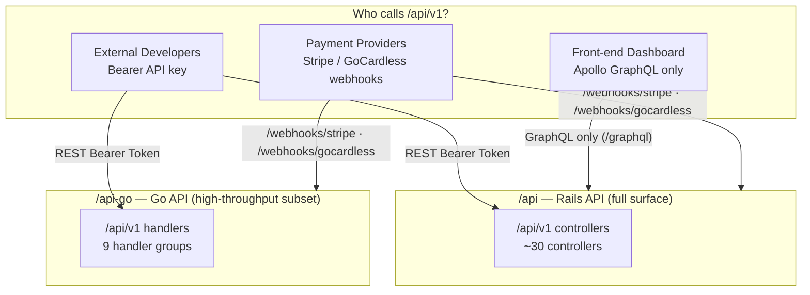

> **Key facts:**
> - The **front-end never calls `/api/v1`** — it uses Apollo GraphQL exclusively.
> - **External API clients** (developers integrating with Lago) call `/api/v1` on both Rails and Go.
> - **Events-processor** and **connectors** never call `/api/v1` — they consume Kafka / SQS.
> - **Rails** is the full platform; **api-go** covers the high-throughput subset.

---

## Rails `/api/v1` — Controller → Service Map

### Core Billing

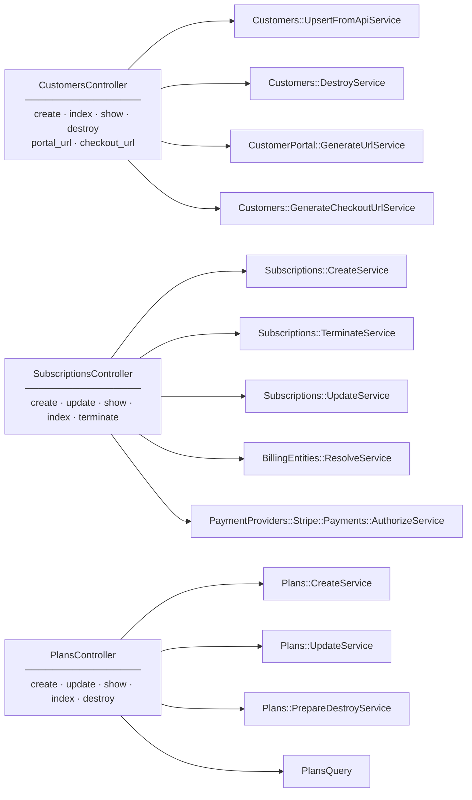

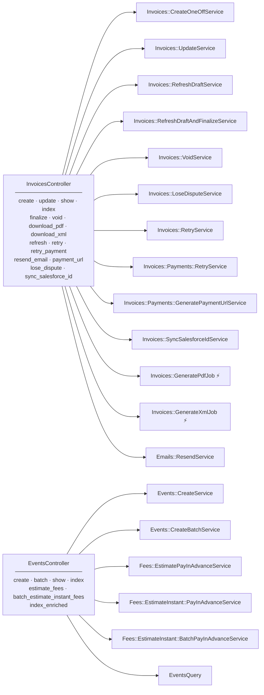

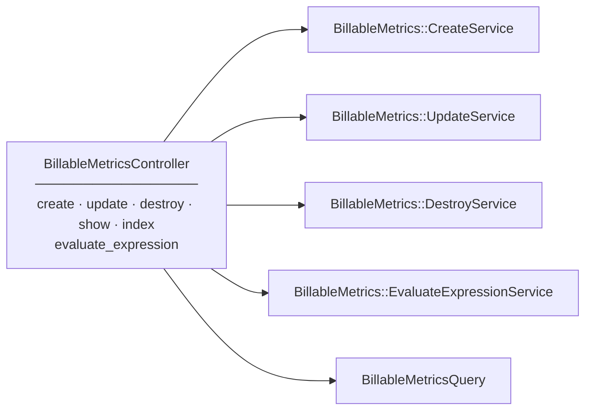

### Finance

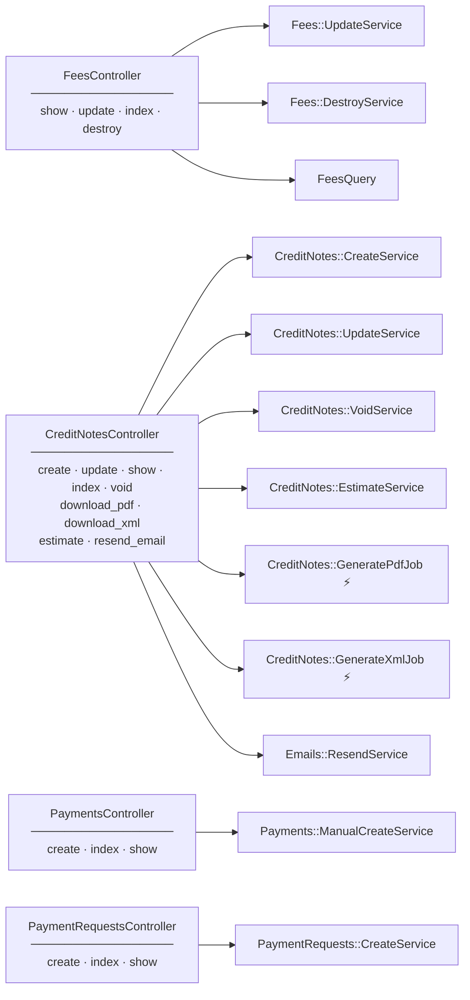

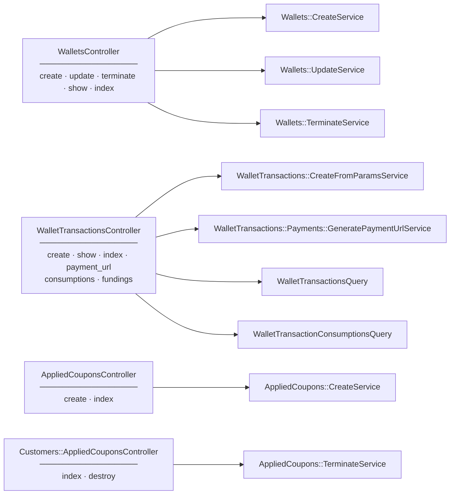

### Catalog

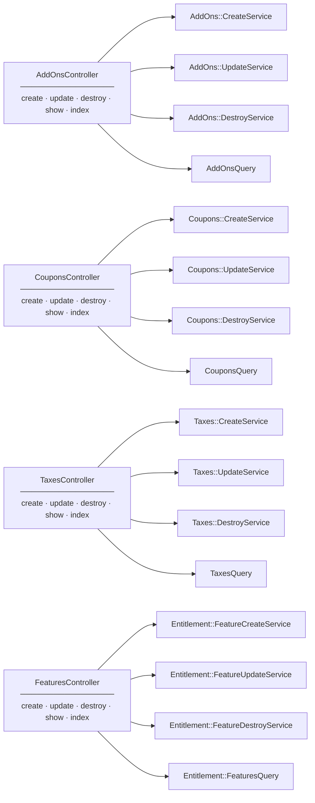

### Configuration & Webhooks

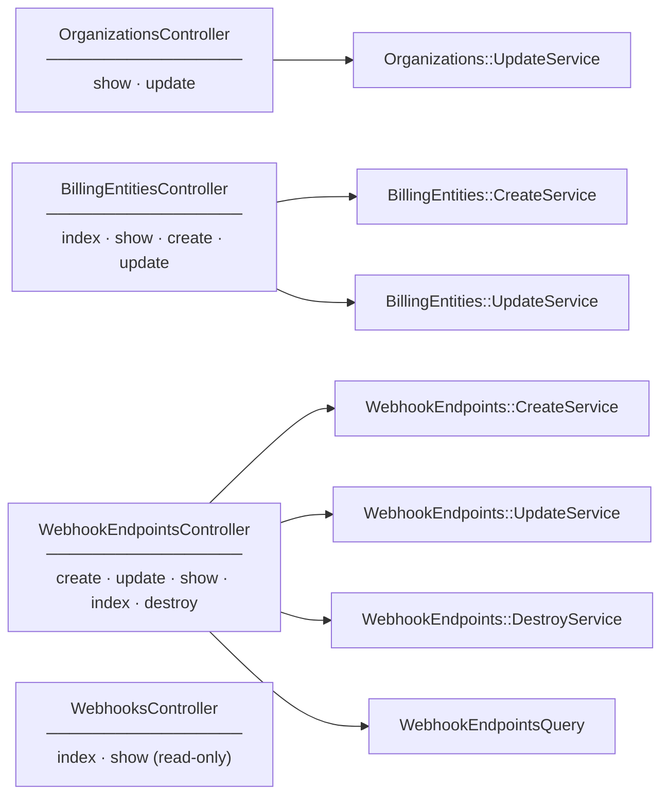

### Analytics & Data

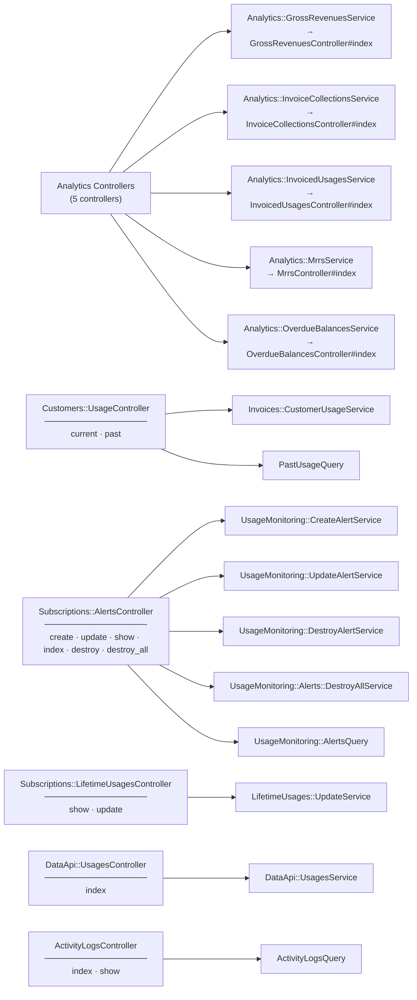

---

## Rails `/api/v1` — Full Reference Table

| Controller | File | Actions | Services / Jobs |
|---|---|---|---|
| **Customers** | `customers_controller.rb` | create, index, show, destroy, portal_url, checkout_url | `Customers::UpsertFromApiService`, `DestroyService`, `CustomerPortal::GenerateUrlService`, `GenerateCheckoutUrlService` |
| **Subscriptions** | `subscriptions_controller.rb` | create, update, show, index, terminate | `Subscriptions::CreateService`, `TerminateService`, `UpdateService`, `BillingEntities::ResolveService`, `Stripe::Payments::AuthorizeService` |
| **Plans** | `plans_controller.rb` | CRUD | `Plans::CreateService`, `UpdateService`, `PrepareDestroyService`, `PlansQuery` |
| **Invoices** | `invoices_controller.rb` | create, update, show, index, finalize, void, refresh, retry, download_pdf, download_xml, resend_email, payment_url, lose_dispute, sync_salesforce_id | `Invoices::CreateOneOffService`, `RefreshDraftAndFinalizeService`, `VoidService`, `LoseDisputeService`, `RetryService`, `Payments::RetryService`, `GeneratePaymentUrlService`, `SyncSalesforceIdService`, **`GeneratePdfJob`**, **`GenerateXmlJob`**, `Emails::ResendService` |
| **Events** | `events_controller.rb` | create, batch, show, index, estimate_fees, batch_estimate_instant_fees | `Events::CreateService`, `CreateBatchService`, `Fees::EstimatePayInAdvanceService`, `EstimateInstant::PayInAdvanceService`, `EstimateInstant::BatchPayInAdvanceService` |
| **BillableMetrics** | `billable_metrics_controller.rb` | CRUD, evaluate_expression | `BillableMetrics::CreateService`, `UpdateService`, `DestroyService`, `EvaluateExpressionService`, `BillableMetricsQuery` |
| **Fees** | `fees_controller.rb` | show, update, index, destroy | `Fees::UpdateService`, `DestroyService`, `FeesQuery` |
| **CreditNotes** | `credit_notes_controller.rb` | create, update, show, index, void, download_pdf, download_xml, estimate, resend_email | `CreditNotes::CreateService`, `UpdateService`, `VoidService`, `EstimateService`, **`GeneratePdfJob`**, **`GenerateXmlJob`**, `Emails::ResendService` |
| **Payments** | `payments_controller.rb` | create, index, show | `Payments::ManualCreateService` |
| **PaymentRequests** | `payment_requests_controller.rb` | create, index, show | `PaymentRequests::CreateService` |
| **Wallets** | `wallets_controller.rb` | create, update, terminate, show, index | `Wallets::CreateService`, `UpdateService`, `TerminateService` |
| **WalletTransactions** | `wallet_transactions_controller.rb` | create, show, index, payment_url, consumptions, fundings | `WalletTransactions::CreateFromParamsService`, `Payments::GeneratePaymentUrlService`, `WalletTransactionsQuery` |
| **Coupons** | `coupons_controller.rb` | CRUD | `Coupons::CreateService`, `UpdateService`, `DestroyService`, `CouponsQuery` |
| **AppliedCoupons** | `applied_coupons_controller.rb` | create, index | `AppliedCoupons::CreateService` |
| **AddOns** | `add_ons_controller.rb` | CRUD | `AddOns::CreateService`, `UpdateService`, `DestroyService`, `AddOnsQuery` |
| **Taxes** | `taxes_controller.rb` | CRUD | `Taxes::CreateService`, `UpdateService`, `DestroyService`, `TaxesQuery` |
| **Features** | `features_controller.rb` | CRUD | `Entitlement::FeatureCreateService`, `FeatureUpdateService`, `FeatureDestroyService`, `FeaturesQuery` |
| **BillingEntities** | `billing_entities_controller.rb` | index, show, create, update | `BillingEntities::CreateService`, `UpdateService` |
| **Organizations** | `organizations_controller.rb` | show, update | `Organizations::UpdateService` |
| **WebhookEndpoints** | `webhook_endpoints_controller.rb` | CRUD | `WebhookEndpoints::CreateService`, `UpdateService`, `DestroyService`, `WebhookEndpointsQuery` |
| **Webhooks** | `webhooks_controller.rb` | index, show | query only |
| **Analytics::GrossRevenues** | `analytics/gross_revenues_controller.rb` | index | `Analytics::GrossRevenuesService` |
| **Analytics::InvoiceCollections** | `analytics/invoice_collections_controller.rb` | index | `Analytics::InvoiceCollectionsService` |
| **Analytics::InvoicedUsages** | `analytics/invoiced_usages_controller.rb` | index | `Analytics::InvoicedUsagesService` |
| **Analytics::Mrrs** | `analytics/mrrs_controller.rb` | index | `Analytics::MrrsService` |
| **Analytics::OverdueBalances** | `analytics/overdue_balances_controller.rb` | index | `Analytics::OverdueBalancesService` |
| **Customers::Usage** | `customers/usage_controller.rb` | current, past | `Invoices::CustomerUsageService`, `PastUsageQuery` |
| **Customers::AppliedCoupons** | `customers/applied_coupons_controller.rb` | index, destroy | `AppliedCoupons::TerminateService` |
| **Customers::Wallets** | `customers/wallets_controller.rb` | create, update, terminate, show, index | — (delegates to Wallets) |
| **Subscriptions::Alerts** | `subscriptions/alerts_controller.rb` | create, update, show, index, destroy, destroy_all | `UsageMonitoring::CreateAlertService`, `UpdateAlertService`, `DestroyAlertService`, `Alerts::DestroyAllService`, `AlertsQuery` |
| **Subscriptions::LifetimeUsages** | `subscriptions/lifetime_usages_controller.rb` | show, update | `LifetimeUsages::UpdateService` |
| **Subscriptions::Charges** | `subscriptions/charges_controller.rb` | index, show, update | — |
| **Subscriptions::Charges::Filters** | `subscriptions/charges/filters_controller.rb` | CRUD | `ChargeFilters::{Create,Update,Destroy}Service` |
| **Subscriptions::FixedCharges** | `subscriptions/fixed_charges_controller.rb` | index, show, update | — |
| **Subscriptions::Entitlements** | `subscriptions/entitlements_controller.rb` | index, destroy, update | — |
| **Plans::Charges** | `plans/charges_controller.rb` | CRUD | `Charges::{Create,Update,Destroy}Service` |
| **Plans::Charges::Filters** | `plans/charges/filters_controller.rb` | CRUD | `ChargeFilters::{Create,Update,Destroy}Service` |
| **Plans::FixedCharges** | `plans/fixed_charges_controller.rb` | CRUD | `FixedCharges::{Create,Update,Destroy}Service` |
| **Plans::Entitlements** | `plans/entitlements_controller.rb` | index, show, create, destroy | `Entitlement::PlanEntitlementsUpdateService` |
| **Plans::Entitlements::Privileges** | `plans/entitlements/privileges_controller.rb` | destroy | `Entitlement::PlanEntitlementPrivilegeDestroyService` |
| **Plans::Metadata** | `plans/metadata_controller.rb` | create, update, destroy | `Plans::UpdateService`, `Metadata::DeleteItemKeyService` |
| **Customers::ProjectedUsage** | `customers/projected_usage_controller.rb` | current | `Invoices::CustomerUsageService` |
| **Customers::PaymentMethods** | `customers/payment_methods_controller.rb` | index, destroy, set_as_default | `PaymentMethods::{Destroy,SetAsDefault}Service` |
| **PaymentReceipts** | `payment_receipts_controller.rb` | index, show, resend_email | `Emails::ResendService` |
| **ApiLogs** | `api_logs_controller.rb` | index, show | query only |
| **SecurityLogs** | `security_logs_controller.rb` | index, show | query only |
| **DataApi::Usages** | `data_api/usages_controller.rb` | index | `DataApi::UsagesService` |
| **ActivityLogs** | `activity_logs_controller.rb` | index, show | `ActivityLogsQuery` |

---

## `api-go` `/api/v1` — Handler → Service Map

| Handler Package | Routes | Service | Extra |
|---|---|---|---|
| `handlers/customers` | POST, GET (list/show), DELETE `/customers`, GET `portal_url` | `customers.NewService` | — |
| `handlers/events` | POST `/events`, POST `/events/batch`, GET `/events`, GET `/events/estimate_fees` | `events.NewService` | Publishes to **Kafka** via `EventPublisher` |
| `handlers/invoices` | POST, GET (list/show), PUT `/finalize`, PUT `/void` | `invoices.NewService` | Domain state machine in `domain/invoices` |
| `handlers/plans` | CRUD `/plans` | `plans.NewService` | — |
| `handlers/subscriptions` | CRUD + DELETE (terminate) + GET `current_usage` | `subscriptions.NewService` | — |
| `handlers/billable_metrics` | CRUD `/billable_metrics` | `billable_metrics.NewService` | — |
| `handlers/webhook_endpoints` | CRUD + GET `event_types` | `webhook_endpoints.NewService` | — |
| `handlers/webhooks` | GET `/webhooks`, GET `/webhooks/:id` | direct GORM query | — |
| `handlers/organizations` | GET, PUT `/organizations` | `organizations.NewService` | — |
| `handlers/auth` | POST `/users/login`, POST `/users/register` | `users.NewAuthService` (JWT) | Public, no API key |

---

## Key Design Observations

1. **Controllers are thin** — all logic is in `*Service` objects; controllers only parse params, invoke a service, and render JSON.
2. **Background jobs are triggered by controllers** — `GeneratePdfJob`, `GenerateXmlJob`, `GeneratePdfJob` (credit notes) are enqueued directly from controller actions.
3. **`api-go` is a strict subset of Rails** — covers 9 of ~30 Rails controller groups, focused on the high-throughput paths.
4. **Front-end is GraphQL-only** — zero direct `/api/v1` REST calls from the dashboard; all UI data goes through Apollo → GraphQL → Rails resolvers.
5. **Events-processor & connectors never call `/api/v1`** — events-processor consumes Kafka; connectors use SQS/HTTP (Benthos config files).
6. **Payment provider webhooks** hit `/webhooks/stripe` and `/webhooks/gocardless` — not `/api/v1` — and have their own signature validation middleware.
7. **Total scope**: 66+ Ruby controllers (across main + nested namespaces) + 11 Go handler groups = **77+ endpoint groups**, **37+ unique service classes**, **4 background jobs**.
