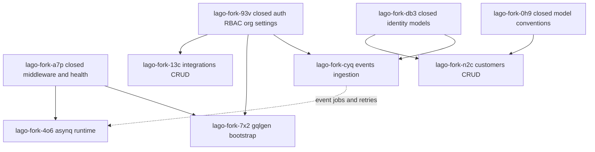

# API-Go Implementation Plan (Selected Issues)

Scope: lago-fork-4o6, lago-fork-n2c, lago-fork-cyq, lago-fork-7x2, lago-fork-13c

## Cross-Issue Dependency Map

## Recommended Execution Order

1. lago-fork-7x2: establish GraphQL foundation early so later domains can attach resolvers without refactor churn.
2. lago-fork-cyq: implement core events ingestion contract and persistence, which unblocks downstream billing flows.
3. lago-fork-4o6: add robust async processing after event ingestion contract is stable.
4. lago-fork-n2c: deliver customer lifecycle APIs required by subscriptions and billing surfaces.
5. lago-fork-13c: build provider integrations after core auth, customer, and event foundations are stable.

## lago-fork-7x2 Initialize gqlgen and expose /graphql

### Goals

- Bootstrap GraphQL server from existing schema with reproducible code generation.
- Expose /graphql endpoint in Gin with introspection enabled for non-production.
- Create baseline GraphQL test to prevent routing/regeneration regressions.

### Technical Tasks

- Copy schema source from api/schema.graphql into api-go GraphQL module structure.
- Add gqlgen config and generation command in Makefile.
- Generate resolver stubs and wire handler into router.
- Add request context bridge from Gin to GraphQL handler.
- Add smoke test for introspection and one trivial query path.

### Likely Files and Modules in api-go

- api-go/internal/server/server.go
- api-go/Makefile
- api-go/go.mod
- api-go/internal/graphql/schema.graphqls
- api-go/internal/graphql/generated/
- api-go/internal/graphql/resolver.go
- api-go/internal/graphql/handler.go
- api-go/internal/graphql/graphql_test.go

### Edge Cases

- Schema import mismatch between Rails schema and gqlgen scalar mappings.
- Production introspection should be gated by environment.
- Generated code drift from local tool version differences.

### Missing Info

- Target gqlgen version and pinned generation command.
- Scalar mapping policy for decimal, datetime, and UUID.
- Introspection policy by environment.

## lago-fork-cyq Implement events ingestion endpoints and validation

### Goals

- Implement POST /api/v1/events and POST /api/v1/events/batch.
- Enforce payload validation and idempotency guarantees.
- Persist accepted events and return contract-compatible responses.

### Technical Tasks

- Define request DTOs and validator rules for single and batch payloads.
- Implement organization-scoped idempotency key strategy (likely transaction_id and organization_id).
- Persist raw event records with normalized timestamp and properties payload.
- Return deterministic partial-success behavior for batch requests.
- Add tests for malformed payloads, duplicate events, and authorization boundaries.

### Likely Files and Modules in api-go

- api-go/internal/server/server.go
- api-go/internal/handlers/events/events.go
- api-go/internal/services/events/ingestion_service.go
- api-go/internal/models/event.go
- api-go/internal/repositories/events/repository.go
- api-go/internal/validators/events_validator.go
- api-go/migrations/000003_events_ingestion.up.sql
- api-go/migrations/000003_events_ingestion.down.sql
- api-go/internal/handlers/events/events_test.go

### Edge Cases

- Same transaction_id reused across different organizations.
- Batch payload with mixed valid and invalid events.
- Timestamp parsing timezone offsets and future timestamps.
- Large properties JSON exceeding practical size limits.

### Missing Info

- Canonical idempotency key definition from Rails behavior.
- Exact response schema for batch partial failures.
- Retention and indexing strategy for raw events table.

## lago-fork-4o6 Setup Asynq workers, scheduler, retries, uniqueness

### Goals

- Introduce production-grade async job runtime for api-go.
- Support retry policies, uniqueness constraints, and scheduled jobs.
- Make retries and failures observable through logs and metrics.

### Technical Tasks

- Add Asynq server and client initialization with Redis config.
- Create queue map and retry policy defaults by job type.
- Add uniqueness keys for idempotent jobs.
- Register cron scheduler for recurring jobs.
- Add job middleware for tracing, structured logs, and panic recovery.
- Add integration tests for retry behavior and duplicate suppression.

### Likely Files and Modules in api-go

- api-go/cmd/api/main.go
- api-go/config/config.go
- api-go/internal/jobs/runtime/runtime.go
- api-go/internal/jobs/runtime/scheduler.go
- api-go/internal/jobs/runtime/client.go
- api-go/internal/jobs/handlers/
- api-go/internal/jobs/tasks/
- api-go/internal/jobs/runtime/runtime_test.go

### Edge Cases

- Redis outage during enqueue or worker startup.
- Duplicate enqueues racing before uniqueness lock acquisition.
- Long-running jobs exceeding timeout and retrying incorrectly.
- Scheduler duplication in multi-instance deployments.

### Missing Info

- Queue priority mapping and concurrency targets.
- Source-of-truth cron schedule list from Rails jobs.
- Policy for dead-letter handling and replay.

## lago-fork-n2c Implement customers CRUD, metadata, portal URL flows

### Goals

- Deliver customer create, read, update, delete endpoints with org scoping.
- Support metadata lifecycle and invoice visibility flags.
- Generate portal URL using deterministic and secure token strategy.

### Technical Tasks

- Finalize customer model parity and unique constraints.
- Implement service layer validation for required and mutable fields.
- Add metadata upsert/delete semantics with transactional consistency.
- Add portal URL generation service and expiry checks.
- Implement API tests for CRUD, metadata updates, and authorization.

### Likely Files and Modules in api-go

- api-go/internal/server/server.go
- api-go/internal/models/customer.go
- api-go/internal/models/customer_metadata.go
- api-go/internal/handlers/customers/customers.go
- api-go/internal/services/customers/customer_service.go
- api-go/internal/services/customers/portal_service.go
- api-go/internal/repositories/customers/repository.go
- api-go/migrations/000004_customers.up.sql
- api-go/migrations/000004_customers.down.sql
- api-go/internal/handlers/customers/customers_test.go

### Edge Cases

- External ID uniqueness under soft-delete behavior.
- Metadata key collisions with case sensitivity differences.
- Portal URL replay after customer state changes.
- Partial updates that clear nullable fields intentionally.

### Missing Info

- Canonical customer response contract fields and defaults.
- Portal token format, signing algorithm, and TTL.
- Whether metadata ordering is required in responses.

## lago-fork-13c Integration CRUD for tax/accounting/CRM providers

### Goals

- Implement integration configuration CRUD for target providers.
- Store provider credentials and settings safely.
- Support provider-customer mapping persistence and validation.

### Technical Tasks

- Define provider-agnostic integration interface and provider-specific validators.
- Add encrypted storage fields for secrets and token refresh metadata.
- Implement organization-scoped CRUD endpoints and filtering.
- Implement customer mapping endpoints and conflict checks.
- Add tests for invalid config, permission failures, and mapping uniqueness.

### Likely Files and Modules in api-go

- api-go/internal/server/server.go
- api-go/internal/models/integration.go
- api-go/internal/models/integration_customer_mapping.go
- api-go/internal/handlers/integrations/integrations.go
- api-go/internal/services/integrations/integration_service.go
- api-go/internal/services/integrations/providers/
- api-go/internal/repositories/integrations/repository.go
- api-go/migrations/000005_integrations.up.sql
- api-go/migrations/000005_integrations.down.sql
- api-go/internal/handlers/integrations/integrations_test.go

### Edge Cases

- Secret rotation while sync jobs are in flight.
- Duplicate provider mappings for same customer.
- Partial provider credentials submitted on update.
- Provider config shape drift as APIs evolve.

### Missing Info

- Required minimum provider set for first release.
- Secret management approach (database encryption vs external KMS).
- Sync ownership boundaries between API and async workers.

## Practical Notes

- Keep endpoint contracts aligned with existing Rails API behavior before broad refactors.
- Prefer integration tests around auth, idempotency, and transactional boundaries first.
- Record any parity gaps as separate bd issues discovered from these five work items.
